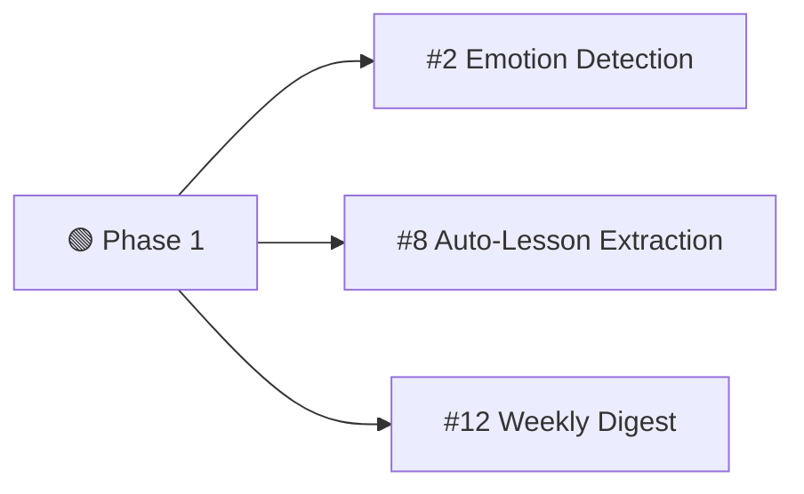
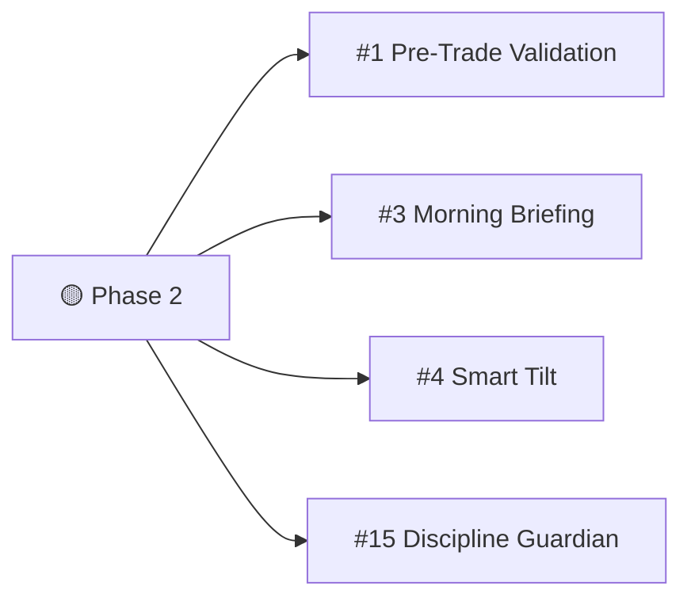
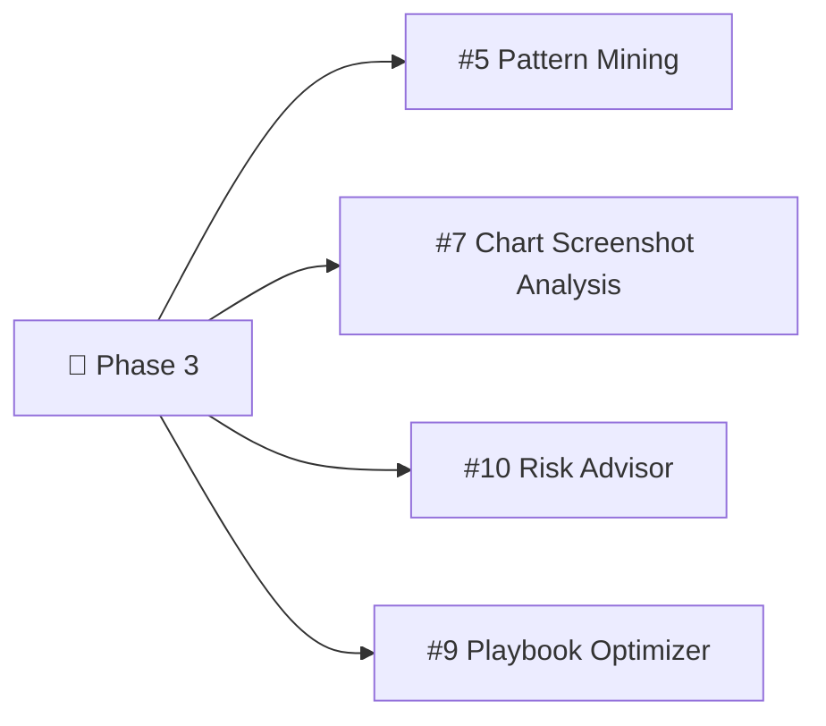
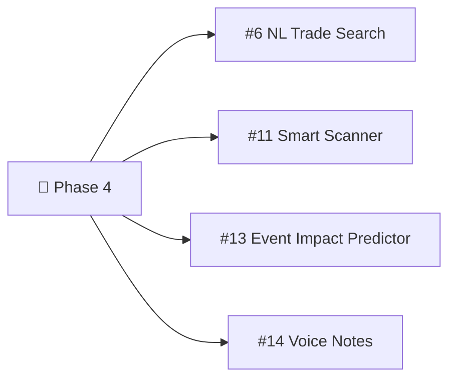

# 🤖 AI Integration Opportunities — Trading Journal

## Application Overview

Your Trading Journal is a **modular monolith** with 9 backend modules and a Next.js frontend covering trade management, analytics, psychology, risk, scanning, gamification, and more.

---

## ✅ Existing AI Features (What You Already Have)

Your `AiInsights` module already integrates OpenRouter for 3 features:

| Feature | Description | Prompt | Status |
|---------|-------------|--------|--------|
| **AI Trade Analysis** | Analyzes a closed trade with screenshots using ICT methodology | `TradingOrderSummary.md` | ✅ Live |
| **AI Review Summary** | Generates periodic review (weekly/monthly) with structured insights | `ReviewSummary.md` | ✅ Live |
| **AI Coach Chat** | Conversational trading coach with 30-day performance context | `AiCoach.md` | ✅ Live |

> [!NOTE]
> All 3 features use the same `OpenRouterAiService` with the chat completions API. The architecture already supports system prompts, multi-turn conversations, and vision (image analysis).

---

## 🚀 New AI Integration Opportunities

### Priority Matrix

| # | Feature | Impact | Effort | Module(s) Affected |
|---|---------|--------|--------|---------------------|
| 1 | [Pre-Trade AI Validation](#1-pre-trade-ai-validation) | 🔴 Critical | Medium | AiInsights, Trades |
| 2 | [AI Emotion Detection from Notes](#2-ai-emotion-detection-from-notes) | 🔴 Critical | Low | AiInsights, Psychology, Trades |
| 3 | [AI-Powered Morning Briefing](#3-ai-powered-morning-briefing) | 🟠 High | Medium | AiInsights, Trades, Scanner |
| 4 | [Smart Tilt Intervention](#4-smart-tilt-intervention) | 🟠 High | Medium | AiInsights, Psychology, Notifications |
| 5 | [AI Pattern Mining from Trade History](#5-ai-pattern-mining-from-trade-history) | 🟠 High | Medium | AiInsights, Analytics |
| 6 | [Natural Language Trade Search](#6-natural-language-trade-search) | 🟡 Medium | Medium | AiInsights, Trades |
| 7 | [AI Screenshot Analysis (Pre-Entry)](#7-ai-screenshot-analysis-pre-entry) | 🔴 Critical | High | AiInsights, Trades |
| 8 | [AI Auto-Lesson Extraction](#8-ai-auto-lesson-extraction) | 🟡 Medium | Low | AiInsights, Trades |
| 9 | [AI Playbook Optimizer](#9-ai-playbook-optimizer) | 🟡 Medium | Medium | AiInsights, Analytics |
| 10 | [AI Risk Advisor](#10-ai-risk-advisor) | 🟠 High | Medium | AiInsights, RiskManagement |
| 11 | [Smart Scanner Confluence](#11-smart-scanner-confluence) | 🟡 Medium | High | AiInsights, Scanner |
| 12 | [AI Weekly Digest Notifications](#12-ai-weekly-digest-notifications) | 🟡 Medium | Low | AiInsights, Notifications |
| 13 | [AI Economic Event Impact Predictor](#13-ai-economic-event-impact-predictor) | 🟡 Medium | Medium | AiInsights, Scanner |
| 14 | [Voice-to-Trade Notes](#14-voice-to-trade-notes) | 🟢 Nice-to-have | High | AiInsights, Trades |
| 15 | [AI Discipline Guardian](#15-ai-discipline-guardian) | 🟠 High | Medium | AiInsights, Trades, Notifications |

---

## Detailed Feature Descriptions

### 1. Pre-Trade AI Validation
**Impact: 🔴 Critical** · **Effort: Medium**

**What:** Before a trader submits a new trade, they can click "Validate with AI" to get an instant assessment of their trade setup against ICT methodology and their personal rules.

**How it works:**
- User fills out the Create Trade form (asset, position, entry, SL, TP, zone, checklist, notes)
- Clicks "AI Validate" → backend sends the setup data + user's pretrade checklist + recent performance to the LLM
- AI returns: **Setup Grade (A-F)**, ICT alignment check, risk/reward assessment, emotional readiness warning, and checklist compliance

**Where to integrate:**
- **Backend:** New endpoint in `AiInsights/Features/V1/` — `ValidateTradeSetup.cs`
- **Backend:** New prompt `PreTradeValidation.md` in `AiInsights/Prompts/`
- **Frontend:** New "AI Validate" button on [create-trade-page.tsx](file:///c:/project/.NET/trading-journal-ui/components/create-trade-page.tsx)
- **Data sources:** `PretradeChecklists`, `TradingZone`, `TechnicalAnalysis` tags, last 10 trades from `TradeProvider`

**Why it's critical:** This is the highest-leverage AI feature — it prevents bad trades BEFORE they happen, directly impacting P&L.

---

### 2. AI Emotion Detection from Notes
**Impact: 🔴 Critical** · **Effort: Low**

**What:** Auto-detect emotions and psychological state from free-text trade notes, daily notes, and psychology entries. Suggest emotion tags instead of requiring manual tagging.

**How it works:**
- When a user writes trade notes or daily notes, the text is sent to LLM for sentiment/emotion classification
- AI returns suggested emotion tags (from the existing emotion list in admin) and a confidence score
- User can accept/modify the suggestions

**Where to integrate:**
- **Backend:** New endpoint `DetectEmotions.cs` in `AiInsights/Features/V1/`
- **Frontend:** Auto-suggest emotion tags in Create Trade form, Daily Notes page, Psychology page
- **Data sources:** User's configured emotions from `admin/emotions`, the note text

**Why it's critical:** Emotion data is foundational for psychology analysis, tilt detection, and AI coach effectiveness — but manual tagging has low compliance. Auto-detection dramatically increases data quality.

---

### 3. AI-Powered Morning Briefing
**Impact: 🟠 High** · **Effort: Medium**

**What:** Replace the static dashboard `focusMessage` with a personalized AI-generated morning briefing that considers open positions, market context, psychological state, and today's economic events.

**How it works:**
- On dashboard load, backend assembles context: open positions, recent P&L trend, tilt score, streak status, upcoming high-impact economic events, yesterday's daily note
- AI generates a concise 3-5 sentence briefing with specific focus areas for today

**Where to integrate:**
- **Backend:** New endpoint `GenerateMorningBriefing.cs` in `AiInsights/Features/V1/`
- **Backend:** New prompt `MorningBriefing.md`
- **Frontend:** Replace `overview.focusMessage` in [dashboard-command-center.tsx](file:///c:/project/.NET/trading-journal-ui/components/dashboard/dashboard-command-center.tsx) with AI-generated content
- **Data sources:** `Dashboard`, `TiltScore`, `Streak`, `EconomicCalendar`, `DailyNotes`

**Example output:**
> "Good morning, Khang. You're on a 5-trade win streak with strong discipline. Today's focus: NFP at 8:30 EST — avoid new entries 30 mins before/after. Your tilt score is low (2/10) — great mental state. Consider your London session FVG setups which have 72% win rate this month."

---

### 4. Smart Tilt Intervention
**Impact: 🟠 High** · **Effort: Medium**

**What:** Enhance the existing rule-based `TiltDetectionService` with AI-powered behavioral analysis that detects subtle tilt patterns and sends proactive intervention notifications.

**How it works:**
- After each trade close, AI analyzes: recent trade sequence, time between trades, deviation from normal patterns, emotion tags, note sentiment
- If tilt risk is detected, a targeted notification is sent via the existing `Notifications` module with specific coaching advice
- The AI can distinguish between different tilt types: revenge trading, FOMO, overconfidence, fatigue

**Where to integrate:**
- **Backend:** Enhance `TiltDetectionService` or create new `AiTiltAnalyzer` in `AiInsights`
- **Backend:** New event handler subscribing to trade close events
- **Frontend:** Special tilt warning notification type in notification panel
- **Data sources:** `TiltScore`, recent trades, emotion tags, `DailyNotes`

---

### 5. AI Pattern Mining from Trade History
**Impact: 🟠 High** · **Effort: Medium**

**What:** AI discovers hidden patterns in your trade data that pure statistics can't reveal. Goes beyond existing analytics (killzone performance, day-of-week breakdown) to find multi-variable correlations.

**How it works:**
- User triggers "Discover Patterns" from Analytics page
- Backend assembles full trade history with all metadata (emotions, zones, TA tags, checklists, time, etc.)
- AI finds patterns like:
  - "You win 85% of FVG trades in London but only 30% in NY"
  - "When you tag 'Anxious', your average loss is 2.5x larger"  
  - "Your Monday trades have -$450 expectancy vs +$120 other days"
  - "After 2 consecutive wins, your 3rd trade has only 25% win rate (overconfidence)"

**Where to integrate:**
- **Backend:** New endpoint `DiscoverPatterns.cs` in `AiInsights/Features/V1/`
- **Backend:** New prompt `PatternDiscovery.md`
- **Frontend:** New section/card on [Analytics page](file:///c:/project/.NET/trading-journal-ui/app/analytics/page.tsx) or dedicated "AI Insights" tab
- **Data sources:** Full trade history with all joins (emotions, TA tags, zones, checklists)

---

### 6. Natural Language Trade Search
**Impact: 🟡 Medium** · **Effort: Medium**

**What:** Search your trade history using natural language instead of dropdown filters.

**Examples:**
- "Show me all losing EURUSD trades in London session when I felt anxious"
- "Find my best FVG setups this month"
- "Trades where I broke rules in the last 2 weeks"

**How it works:**
- User types a natural language query
- AI translates the query into structured filter parameters (asset, date range, emotions, zones, TA tags, P&L direction)
- Backend executes the structured query against the existing `GetTrades` endpoint

**Where to integrate:**
- **Backend:** New endpoint `SearchTradesNaturalLanguage.cs` that converts NL → structured filters
- **Frontend:** AI search bar on [History page](file:///c:/project/.NET/trading-journal-ui/app/history/page.tsx)
- **Data sources:** Existing `GetTrades` query infrastructure

---

### 7. AI Screenshot Analysis (Pre-Entry)
**Impact: 🔴 Critical** · **Effort: High**

**What:** Upload a chart screenshot BEFORE entering a trade, and AI analyzes it for ICT patterns, market structure, premium/discount zones, and setup quality.

**How it works:**
- On the Create Trade form, user uploads a chart screenshot
- AI Vision model analyzes the chart and identifies: market structure (BOS/CHoCH), key levels, FVGs, order blocks, liquidity zones, current AMD phase
- Returns a visual analysis summary with a setup confidence score

**Where to integrate:**
- **Backend:** New endpoint `AnalyzeChartScreenshot.cs` in `AiInsights/Features/V1/`
- **Backend:** New prompt `ChartAnalysis.md` focused on visual ICT pattern recognition
- **Frontend:** New "Analyze Chart" button in Create Trade page's screenshot upload section
- **Reuses:** Existing `IImageHelper` for image processing, existing vision model capability in `SendOpenRouterRequest`

**Why it's critical:** This turns AI into a real-time trading assistant, not just a post-mortem reviewer.

> [!WARNING]
> Vision model accuracy for chart analysis varies significantly. Recommend starting with structured overlay screenshots (TradingView with drawings) rather than raw price charts. Consider adding a confidence disclaimer.

---

### 8. AI Auto-Lesson Extraction
**Impact: 🟡 Medium** · **Effort: Low**

**What:** After accumulating several trades with similar mistakes, AI automatically suggests new lessons to create.

**How it works:**
- Periodic background job or triggered after N trades
- AI analyzes recent trades looking for recurring mistake patterns
- Suggests pre-drafted lessons with title, description, category, and linked trades
- User reviews and approves

**Where to integrate:**
- **Backend:** New endpoint `SuggestLessons.cs` in `AiInsights/Features/V1/`
- **Frontend:** "AI Suggestions" section on [Lessons page](file:///c:/project/.NET/trading-journal-ui/app/lessons/page.tsx)
- **Data sources:** Trade history with AI analysis results, existing lessons (to avoid duplicates)

---

### 9. AI Playbook Optimizer
**Impact: 🟡 Medium** · **Effort: Medium**

**What:** AI reviews your playbook/setup performance data and recommends which setups to keep, refine, or retire.

**How it works:**
- AI ingests data from existing `GetPlaybookOverview`, `GetSetupPerformance`, `CompareSetups`
- Generates recommendations:
  - "Your OB+FVG setup has the highest edge — prioritize this"
  - "Your Asian Range Breakout setup has negative expectancy over 30 trades — consider retiring it"
  - "Your London FVG has high win rate but low R:R — try holding to T2 more often"

**Where to integrate:**
- **Backend:** New endpoint `OptimizePlaybook.cs` in `AiInsights/Features/V1/`
- **Frontend:** New AI section on [Playbook page](file:///c:/project/.NET/trading-journal-ui/app/playbook/page.tsx)

---

### 10. AI Risk Advisor
**Impact: 🟠 High** · **Effort: Medium**

**What:** AI analyzes your current risk exposure, account balance trajectory, and position sizing habits to provide real-time risk management advice.

**How it works:**
- AI ingests: account balance history, correlation matrix, current open positions, risk config, recent drawdown data
- Generates warnings and recommendations:
  - "You have 3 correlated USD positions — total exposure is 6% (your rule says max 3%)"
  - "Your drawdown is approaching your max daily loss limit"
  - "Based on your recent win rate, consider reducing position size to 0.5% per trade"

**Where to integrate:**
- **Backend:** New endpoint `GetRiskAdvice.cs` in `AiInsights/Features/V1/`
- **Frontend:** AI advisor card on [Risk page](file:///c:/project/.NET/trading-journal-ui/app/risk/page.tsx)
- **Data sources:** `RiskDashboard`, `AccountBalanceHistory`, `CorrelationMatrix`, `RiskConfig`, open positions

---

### 11. Smart Scanner Confluence
**Impact: 🟡 Medium** · **Effort: High**

**What:** Enhance the ICT pattern scanner with AI-powered confluence scoring that considers market context, economic events, and historical performance.

**How it works:**
- When scanner detects patterns, AI evaluates confluence in context:
  - Does the pattern align with HTF structure?
  - Are there upcoming economic events that could invalidate the setup?
  - How has the user performed on similar patterns historically?
- Returns an AI-enhanced confluence score with reasoning

**Where to integrate:**
- **Backend:** New service in `AiInsights` that processes scanner alerts
- **Frontend:** AI score badge on scanner results
- **Data sources:** Scanner detections, `EconomicCalendar`, user trade history by pattern type

> [!IMPORTANT]
> This is high-effort because it requires real-time market data integration and could significantly increase AI API costs due to frequency of scanner events. Consider batch processing.

---

### 12. AI Weekly Digest Notifications
**Impact: 🟡 Medium** · **Effort: Low**

**What:** Automated weekly AI-generated performance digest delivered as an in-app notification.

**How it works:**
- Scheduled background job runs every Sunday evening
- Assembles weekly performance data (same data as Review Summary but lighter)
- AI generates a concise 3-paragraph digest: highlights, concerns, one action item
- Delivered through existing `Notifications` module + SignalR hub

**Where to integrate:**
- **Backend:** Scheduled job in `AiInsights` that publishes to `Notifications`
- **Backend:** Reuse `ReviewSnapshot` builder from existing `GenerateReviewSummary`
- **Frontend:** Already supported by existing notification UI

---

### 13. AI Economic Event Impact Predictor
**Impact: 🟡 Medium** · **Effort: Medium**

**What:** AI predicts how upcoming economic events might impact your open positions and watchlist assets.

**How it works:**
- Combines `GetUpcomingHighImpactEvents` with user's open positions and watchlist
- AI assesses potential impact per position/asset
- Generates actionable recommendations: "Consider tightening SL on EURUSD before ECB decision"

**Where to integrate:**
- **Backend:** New endpoint in `AiInsights` consuming `EconomicCalendar` + `TradeProvider` data
- **Frontend:** Impact column on Economic Calendar view, warning cards on Dashboard
- **Data sources:** `EconomicCalendar`, open positions, watchlist assets

---

### 14. Voice-to-Trade Notes
**Impact: 🟢 Nice-to-have** · **Effort: High**

**What:** Record voice memos during/after trades. AI transcribes the audio and extracts structured data (emotions, observations, entry reasoning).

**How it works:**
- User records voice note on Create Trade page or Daily Notes
- Audio sent to Whisper API (or similar) for transcription
- LLM processes transcript → extracts: emotion tags, technical observations, entry/exit reasoning
- Populates form fields automatically

**Where to integrate:**
- **Backend:** New audio processing endpoint, integration with speech-to-text API
- **Frontend:** Microphone button on Create Trade form and Daily Notes
- **Requires:** Additional API integration (OpenAI Whisper / Azure Speech)

---

### 15. AI Discipline Guardian
**Impact: 🟠 High** · **Effort: Medium**

**What:** AI monitors trading behavior in real-time against discipline rules and sends proactive alerts before rules are broken.

**How it works:**
- After each trade action (open/close), AI evaluates against user's `DisciplineRules`:
  - "Max 3 trades per day" → You've taken 2, next one needs extra validation
  - "No trading after 2 consecutive losses" → Alert before 3rd trade
  - "Max 2% risk per trade" → Position size check
- Delivers notifications via existing `Notifications` hub

**Where to integrate:**
- **Backend:** Event handler on trade creation that checks discipline rules via AI
- **Backend:** Enhance `LogDiscipline` to be predictive, not just retrospective
- **Frontend:** Real-time warning toasts when approaching rule limits
- **Data sources:** `DisciplineRules`, `DisciplineLogs`, today's trades

---

## 📐 Recommended Implementation Roadmap

### Phase 1 — Quick Wins (1-2 weeks each)
These leverage your existing `OpenRouterAiService` infrastructure with minimal new code:



- **#2 AI Emotion Detection** — 1 new endpoint + frontend auto-suggest. Reuses existing prompt infrastructure.
- **#8 Auto-Lesson Extraction** — 1 new endpoint. Reuses trade data providers.
- **#12 Weekly Digest** — 1 scheduled job + reuses existing `ReviewSnapshot` builder.

### Phase 2 — High-Impact Features (2-4 weeks each)



- **#1 Pre-Trade Validation** — Highest leverage feature. New prompt + endpoint + UI button.
- **#3 Morning Briefing** — Replaces static focus message with AI. Impressive UX upgrade.
- **#4 Smart Tilt Intervention** — Enhances existing tilt system. New event handler.
- **#15 Discipline Guardian** — Real-time protection against rule violations.

### Phase 3 — Advanced Features (1-2 months)



### Phase 4 — Premium Features (2+ months)



---

## 🏗️ Architecture Recommendations

### 1. Shared AI Infrastructure
Your `OpenRouterAiService` already centralizes API calls. Extend it with:

```csharp
// Add to IOpenRouterAIService interface
Task<T?> StructuredCompletionAsync<T>(string prompt, CancellationToken ct);
Task<string> SimpleCompletionAsync(string systemPrompt, string userMessage, CancellationToken ct);
```

### 2. Prompt Management
You already use `.md` files for prompts — excellent pattern. Continue this for all new features:

```
Prompts/
├── AiCoach.md              ← existing
├── ReviewSummary.md         ← existing  
├── TradingOrderSummary.md   ← existing
├── PreTradeValidation.md    ← NEW
├── EmotionDetection.md      ← NEW
├── MorningBriefing.md       ← NEW
├── PatternDiscovery.md      ← NEW
├── ChartAnalysis.md         ← NEW
├── LessonSuggestion.md      ← NEW
├── PlaybookOptimizer.md     ← NEW
├── RiskAdvisor.md           ← NEW
└── WeeklyDigest.md          ← NEW
```

### 3. Cost Management
> [!CAUTION]
> Each new AI feature adds API costs. Implement these safeguards:
> - **Rate limiting** per user per feature (e.g., 10 validations/day)
> - **Caching** for slow-changing insights (morning briefing, pattern mining)
> - **Tiered models** — use cheaper models (GPT-4o-mini) for simple tasks (emotion detection) and powerful models for complex analysis (chart analysis)
> - **Background processing** for non-interactive features (weekly digest, pattern mining)

### 4. AI Response Caching Strategy

| Feature | Cache Duration | Strategy |
|---------|---------------|----------|
| Morning Briefing | 4 hours | Redis cache, invalidate on trade close |
| Emotion Detection | Per-note | Store with note, no expiry |
| Pattern Mining | 24 hours | Background job, store in DB |
| Pre-Trade Validation | No cache | Real-time, every request |
| Weekly Digest | 7 days | Store in Notifications table |

---

## Summary

Your app already has a solid AI foundation with 3 live features. The **biggest bang for your buck** is:

1. **#2 Emotion Detection** — Low effort, massively improves data quality for all other AI features
2. **#1 Pre-Trade Validation** — Prevents bad trades. Direct P&L impact.
3. **#3 Morning Briefing** — WOW factor for the dashboard. Makes the app feel alive.

Would you like me to start implementing any of these features?
