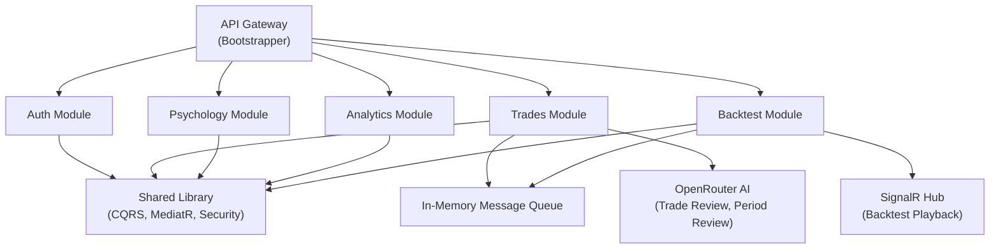

# 🔍 Trading Journal — Comprehensive App Review

> Full-stack review of `trading-journal-backend` (.NET 9 Modular Monolith) and `trading-journal-ui` (Next.js 16 + React 19).
> Reviewed: April 25, 2026

---

## Table of Contents

1. [Architecture Overview](#1-architecture-overview)
2. [What's Working Well ✅](#2-whats-working-well)
3. [Technical Debt & Refactoring Needs 🔧](#3-technical-debt--refactoring-needs)
4. [Missing Core Features 🚨](#4-missing-core-features)
5. [Features to Add (Competitive Edge) 🚀](#5-features-to-add-competitive-edge)
6. [Prioritized Action Plan](#6-prioritized-action-plan)

---

## 1. Architecture Overview

### Backend (.NET Modular Monolith)



| Aspect | Stack |
|--------|-------|
| **Backend** | .NET 9, MediatR (CQRS), Carter (Minimal API), EF Core (SQL Server), FluentValidation |
| **Frontend** | Next.js 16, React 19, Zustand + Context API, Tailwind CSS 4, Radix UI, Recharts, KlineCharts |
| **AI** | OpenRouter API (trade analysis + period review summaries) |
| **Real-time** | SignalR (backtest playback) |
| **Auth** | JWT with refresh tokens, role-based (User/Admin) |
| **Testing** | xUnit (52 backend tests), Vitest (23 frontend tests) |

### Frontend Route Map

| Route | Purpose | Page Size |
|-------|---------|-----------|
| `/` | Dashboard (home) | 8.5 KB |
| `/trade/new` | Create trade wizard | uses 74 KB component |
| `/trade/[id]` | Trade detail | — |
| `/history` | Trade history list | 30 KB |
| `/analytics` | Performance analytics | 49 KB |
| `/psychology` | Psychology journal | 78 KB |
| `/review` | AI-powered period reviews | 5.5 KB |
| `/backtest` | Backtest session dashboard | 10 KB |
| `/backtest/[id]` | Backtest replay workspace | — |
| `/setup` | Setup/strategy flow builder | 1.2 KB |
| `/settings/*` | Discipline, pretrade models | — |
| `/admin/*` | Admin panel (staff, assets, zones) | — |

---

## 2. What's Working Well ✅

### Backend
- **Clean modular architecture** — Each domain (Trades, Psychology, Analytics, Backtest, Auth) is a separate module with its own DbContext, migrations, and feature slices. This is excellent for maintainability.
- **Vertical slice architecture** — Features organized as self-contained units (Request → Validator → Handler → Endpoint) using MediatR + Carter. Clean separation of concerns.
- **Comprehensive domain models** — `TradeHistory` captures entry/exit, multi-tier targets, stop loss, emotions, technical analysis tags, checklists, screenshots, confidence level, trading zones, and sessions.
- **Sophisticated backtest engine** — Intra-bar M1 evaluation for accurate SL/TP resolution prevents look-ahead bias. Well-documented with XML comments.
- **AI integration** — OpenRouter integration for both individual trade analysis and period review summaries, with multimodal support (screenshot analysis).
- **Security fundamentals** — JWT with refresh token rotation, rate limiting (global + auth-specific), CORS, HSTS, security headers, admin authorization policy.
- **Good test coverage** — 52 backend unit tests across all modules covering features, services, and edge cases.

### Frontend
- **Modern stack** — Next.js 16 + React 19 with proper SSR/hydration handling.
- **Rich trade entry** — Multi-step wizard with live risk score, checklist progress, screenshot upload, emotion tagging, and confidence tracking.
- **Backtest workspace** — Full-featured with KlineCharts, order panel, positions management, drawing tools, playback controls, and timeframe switching with optimistic updates.
- **Auth flow** — Proper token refresh with request queuing, auth guards, and redirect handling.
- **23 frontend tests** — Covering stores, hooks, components, and backtest logic.

---

## 3. Technical Debt & Refactoring Needs 🔧

### 🔴 Critical (Fix Now)

#### 3.1 `trade-context.tsx` is a God Context (780 lines)

This single context manages **trades, sessions, psychology entries, strategies, templates, AND backtest execution**. It violates single responsibility badly.

```
TradeContext manages:
├── Trades (CRUD) — still uses local state, not API
├── User Sessions (start/end)
├── Psychology Entries — still uses sample data
├── Strategies (CRUD via API)
├── Templates (CRUD via API)
├── Backtest progressive run
└── Backtest cancellation
```

> [!WARNING]
> **Psychology entries use hardcoded sample data** (`samplePsychologyEntries`), not the API. The `useEffect` on mount (line 178-180) is empty — strategies/templates are never loaded from API on mount either.

**Recommendation:** Split into 4 focused contexts/stores:
- `useTradeStore` (Zustand) — Trade CRUD via API
- `usePsychologyStore` (Zustand) — Psychology CRUD via API
- `useStrategyStore` (Zustand) — Strategy + template management
- `useSessionStore` (Zustand) — Trading session management

#### 3.2 Inconsistent State Management

The app uses **three different patterns** simultaneously:
| Pattern | Used For |
|---------|----------|
| React Context (`TradeContext`) | Trades, sessions, strategies, psychology |
| Zustand Store (`useBacktestStore`) | Backtest workspace |
| Local component state | Analytics, review pages |

**Recommendation:** Standardize on **Zustand** for all global state. You're already using it well for the backtest store — extend the pattern.

#### 3.3 Massive Component Files

| File | Lines | Problem |
|------|-------|---------|
| `create-trade-page.tsx` | 1,743 | Entire wizard in one file |
| `psychology/page.tsx` | ~2,000+ | 78KB single page component |
| `analytics/page.tsx` | ~1,400+ | 49KB single page component |
| `history/page.tsx` | ~800+ | 30KB single page component |

**Recommendation:** Extract these into smaller composable components:
```
create-trade-page/
├── trade-form-section.tsx
├── trade-setup-step.tsx
├── trade-context-step.tsx
├── trade-review-step.tsx
├── trade-summary-stats.tsx
└── index.tsx (orchestrator)
```

#### 3.4 Duplicated Analytics Computation

`GetPerformanceSummary.cs` and `GetInsights.cs` compute **identical metrics** independently (win rate, profit factor, max drawdown, Sharpe ratio, consecutive wins/losses, long/short win rates). ~100 lines of duplicated calculation.

**Recommendation:** Extract into a shared `AnalyticsMetricsCalculator` service.

---

### 🟡 Important (Fix Soon)

#### 3.5 Mixed JSON Serializers

The exception handler middleware uses **Newtonsoft.Json** while the rest of the app uses **System.Text.Json**. This causes inconsistent JSON formatting.

```csharp
// Middleware uses Newtonsoft:
await context.Response.WriteAsync(JsonConvert.SerializeObject(error, JsonSerializerSettings));

// Everything else uses System.Text.Json:
options.SerializerOptions.ReferenceHandler = ReferenceHandler.IgnoreCycles;
```

**Recommendation:** Migrate the middleware to `System.Text.Json` and remove the Newtonsoft dependency.

#### 3.6 Swallowed Exceptions in Migration

```csharp
catch (Exception)
{
    // Log exception if needed  ← This is dangerous
}
```

Database migration failures are silently swallowed. A failed migration could leave the DB in an inconsistent state.

**Recommendation:** Log the error properly. Throw in development, log as critical in production.

#### 3.7 `any` Types Scattered in Frontend

Multiple files use `any` liberally, bypassing TypeScript's safety:

```typescript
export async function loginUser(data: any) { ... }
export async function registerUser(data: any) { ... }
export async function getBacktestDetail(id: number) { return api.get<ApiResponse<any>>(...) }
```

**Recommendation:** Define proper request/response DTOs for all API calls.

#### 3.8 Hardcoded Chinese/Vietnamese Text in Code

```typescript
avgHoldingPeriod: strat.timeframe === "1D" || strat.timeframe === "1W" ? "几天" : "数小时",
```

```csharp
{ "{{TopAsset}}", metrics.TopAsset ?? "Không có dữ liệu" },
{ "{{PrimaryTradingZone}}", metrics.PrimaryTradingZone ?? "Không có dữ liệu" },
```

**Recommendation:** Extract all user-facing strings into a proper i18n/localization system.

#### 3.9 No Caching Layer

The `ITradeProvider.GetTradesAsync()` is called by every analytics endpoint, fetching all trades from the database each time. No caching.

**Recommendation:** Add an in-memory cache (e.g., `IMemoryCache`) with invalidation when trades are created/updated/deleted via domain events.

#### 3.10 Frontend API Layer Fragmentation

API calls are spread across **8+ files** with inconsistent patterns:

| File | Purpose | Pattern |
|------|---------|---------|
| `api.ts` | Core + auth + backtest | Mixed exports |
| `analytics-api.ts` | Analytics calls | — |
| `admin-api.ts` | Admin calls | — |
| `review-api.ts` | Review calls | — |
| `backtest-store.ts` | Backtest API + store | Inline API functions |
| `trade-context.tsx` | Strategy API calls | Inline in context |
| `create-trade-page.tsx` | Reference data loading | Direct `api.get()` |
| `discipline-api.ts` | Discipline API | — |

**Recommendation:** Organize all API calls into a clean layer:
```
lib/api/
├── client.ts          (axios instance + interceptors)
├── auth.ts            (login, register, refresh)
├── trades.ts          (CRUD trades)
├── analytics.ts       (performance, insights, etc.)
├── psychology.ts      (journal CRUD)
├── backtest.ts        (sessions, orders, playback)
├── review.ts          (period reviews)
└── admin.ts           (admin operations)
```

---

### 🟢 Minor (Nice to Fix)

#### 3.11 `replace_script.js` in Root

An 11KB script in the project root — likely a one-off migration tool. Should be removed or moved to a scripts/ directory.

#### 3.12 Package Name Still `my-v0-project`

```json
"name": "my-v0-project"
```

Should be renamed to `trading-journal` or similar.

#### 3.13 `recharts: "latest"` — Pinned to Latest

This is risky. Should pin to a specific version to prevent breaking changes.

#### 3.14 Empty `jobs/` Directory

The solution has a `/jobs/` folder and section but it's completely empty. Either implement background jobs or remove the folder.

#### 3.15 `src/` Contains Only `obj/`

The `src/` directory exists but only contains a build artifact folder.

---

## 4. Missing Core Features 🚨

### 4.1 🔴 Trade Import/Export

**No ability to import trades from brokers or export trade data.** This is table-stakes for any trading journal.

| Feature | Priority |
|---------|----------|
| CSV/Excel import from popular brokers (MT4/MT5, TradingView, Interactive Brokers) | Critical |
| CSV/Excel export of all trades | Critical |
| API integration with brokers (via webhooks or polling) | High |

### 4.2 🔴 Position Size Calculator (Backend)

The frontend has a `position-calculator.tsx` component, but there's **no corresponding backend service** for position sizing calculations based on account equity and risk percentage. It appears to be purely client-side.

### 4.3 🔴 Trade Edit (Frontend → Backend Integration)

The `updateTrade` in `trade-context.tsx` only updates **local state** — it never calls the API:

```typescript
const updateTrade = (id: string, updates: Partial<Trade>) => {
    setTrades((prev) =>
      prev.map((trade) => (trade.id === id ? { ...trade, ...updates } : trade))
    )
}
```

Same issue with `deleteTrade` and `closeTrade`. **These operations are lost on page refresh.**

### 4.4 🔴 Notification System

No notification system exists. Users should be notified of:
- AI review completions
- Trading session reminders
- Daily/weekly performance summaries
- Rule-break alerts

### 4.5 🟡 Goal Setting & Tracking

No ability for traders to set goals (e.g., "maintain 55%+ win rate", "max 2% risk per trade", "trade only during London session") and track progress against them.

### 4.6 🟡 Trade Tagging / Custom Labels

While emotion tags and technical analysis tags exist, there's no **user-defined custom tagging** system for categorizing trades by personal criteria (e.g., "A+ setup", "revenge trade", "news-driven").

### 4.7 🟡 Journal / Notes History

The psychology module only tracks a single `TodayTradingReview` field. There's no rich journaling system with:
- Pre-market analysis notes
- Post-session reflection
- Free-form daily journal entries
- Attachment support beyond screenshots

### 4.8 🟡 Multi-Currency / Multi-Account Support

The `TradeHistory` model has no concept of:
- Trading account (traders often have multiple accounts)
- Account currency
- Lot size / contract size for proper PnL calculation
- Commission / swap tracking

### 4.9 🟡 Password Reset Flow

`/forgot-password` route exists but needs backend support for email-based password reset with secure tokens.

### 4.10 🟡 User Profile / Settings Page

No user profile page for:
- Changing password
- Updating email
- Setting timezone preferences
- Configuring default risk parameters
- Account equity tracking

---

## 5. Features to Add (Competitive Edge) 🚀

### 5.1 AI Trading Coach

Extend the existing OpenRouter integration into a **conversational AI coach**:

| Feature | Description |
|---------|-------------|
| Chat interface | Ask questions about your trading patterns |
| Pattern detection | "You tend to lose on Fridays during NY session" |
| Setup validation | Pre-trade AI check against your playbook rules |
| Emotional awareness | "Your win rate drops 30% when logging 'FOMO' emotion" |

### 5.2 Advanced Correlation Analytics

| Feature | Current | Needed |
|---------|---------|--------|
| Emotion vs. PnL | ❌ | Scatter plot + correlation coefficient |
| Confidence vs. Win Rate | ❌ | Track if high-confidence trades actually perform |
| Time-of-day performance | Partial (zone-based) | Hourly heatmap |
| Setup adherence score | ❌ | % of checklist completion vs. trade outcome |
| Streak analysis | Basic (consecutive) | Tilt detection, cooling period suggestions |

### 5.3 Risk Management Dashboard

A dedicated real-time risk dashboard:
- **Daily P&L tracker** with configurable max daily loss limit
- **Drawdown monitor** with alerts at configurable thresholds
- **Position sizing enforcer** — validate against rules before trade entry
- **Account equity curve** (separate from trade-level equity curve)
- **Risk exposure by asset/sector**

### 5.4 Playbook Enforcement

The setup flow builder exists but there's no **enforcement**:
- Before creating a trade, validate it against the active playbook
- Show which playbook rules are being followed vs. violated
- Track playbook adherence rate over time

### 5.5 Mobile-Responsive Trading View

While the app uses responsive Tailwind classes, the complex pages (backtest workspace, create trade wizard) likely need dedicated mobile layouts. Consider:
- Bottom sheet for order entry on mobile
- Swipeable chart on mobile backtest
- Simplified create-trade flow for mobile

### 5.6 Social / Community Features

| Feature | Description |
|---------|-------------|
| Trade sharing | Generate shareable trade cards (image) |
| Public profile | Optional performance dashboard for sharing |
| Trade idea feed | Follow other traders' setups |

### 5.7 Advanced Backtest Features

| Feature | Current | Needed |
|---------|---------|--------|
| Walk-forward analysis | ❌ | Split data into in-sample/out-of-sample |
| Monte Carlo simulation | ❌ | Stress-test strategy robustness |
| Multi-asset backtest | Single asset | Correlations across assets |
| Backtest vs. Live comparison | ❌ | Compare backtest results with live execution |
| Slippage modeling | Basic spread | Realistic slippage based on volume |

### 5.8 Webhook Integration

- **TradingView alerts → Auto-create trade entries**
- **Telegram/Discord notifications** for session reminders, AI review completions
- **Broker webhooks** for auto-importing executed trades

---

## 6. Prioritized Action Plan

### Phase 1: Fix Foundation (1-2 weeks)

| # | Task | Impact |
|---|------|--------|
| 1 | Wire trade CRUD (update, delete, close) to API — currently local-only | 🔴 Data loss |
| 2 | Wire psychology entries to API — currently sample data | 🔴 Data loss |
| 3 | Load strategies/templates from API on mount (empty `useEffect`) | 🔴 Data loss |
| 4 | Split `trade-context.tsx` into focused Zustand stores | 🔴 Maintainability |
| 5 | Add proper error logging for migration failures | 🟡 Reliability |
| 6 | Pin `recharts` to specific version | 🟡 Stability |

### Phase 2: Core Feature Gaps (2-4 weeks)

| # | Task | Impact |
|---|------|--------|
| 7 | Trade CSV import/export | 🔴 Core feature |
| 8 | Multi-account support | 🟡 Core feature |
| 9 | Commission/swap tracking in trade model | 🟡 Accuracy |
| 10 | User profile & settings page | 🟡 Core feature |
| 11 | Notification system (at minimum: in-app toasts for AI completions) | 🟡 UX |
| 12 | Password reset flow (backend email service) | 🟡 Auth |

### Phase 3: Refactoring & Quality (2-3 weeks)

| # | Task | Impact | Status |
|---|------|--------|--------|
| 13 | Extract analytics calculation into shared service | 🟡 DRY | ✅ Done — `AnalyticsMetricsCalculator.cs` |
| 14 | Migrate exception middleware to System.Text.Json | 🟢 Consistency | ✅ Done — Newtonsoft fully removed |
| 15 | Break apart large page components (psychology: 78KB, analytics: 49KB) | 🟡 Maintainability | ⏳ Deferred |
| 16 | Consolidate API layer into organized modules | 🟡 DX | ✅ Done — typed sections in api.ts |
| 17 | Replace `any` types with proper DTOs | 🟡 Type safety | ✅ Done — 0 `any` in lib/ |
| 18 | Add caching layer for trade data in analytics | 🟡 Performance | ✅ Already done via ICacheRepository |
| 19 | Internationalization (extract hardcoded strings) | 🟢 i18n | ✅ Done — Vietnamese → English |

### Phase 4: Competitive Differentiation (4-8 weeks)

| # | Task | Impact |
|---|------|--------|
| 20 | AI Trading Coach (conversational) | 🚀 Differentiator |
| 21 | Emotion-Performance correlation analytics | 🚀 Differentiator |
| 22 | Risk management dashboard | 🚀 Core value |
| 23 | Playbook enforcement (validate trades against rules) | 🚀 Core value |
| 24 | Goal setting & tracking | 🟡 Engagement |
| 25 | TradingView webhook integration | 🟡 Automation |
| 26 | Advanced backtest features (walk-forward, Monte Carlo) | 🟡 Power users |

---

> [!IMPORTANT]
> **Top 3 urgent items:**
> 1. **Trade/Psychology CRUD not wired to API** — users will lose data on refresh
> 2. **God Context splitting** — `trade-context.tsx` is a maintenance nightmare at 780 lines
> 3. **Trade import/export** — table-stakes feature missing entirely

> [!TIP]
> Your **backtest engine with intra-bar M1 evaluation** and **AI-powered trade review** are genuine differentiators. Double down on these with better UX and the AI Coach feature.
