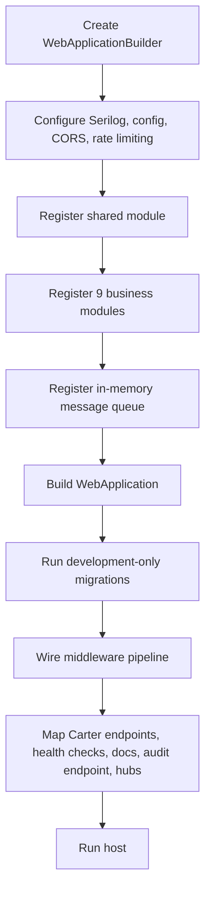
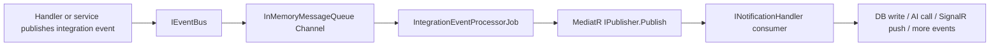

# Backend Code Flow

> Purpose: explain how the backend executes, not just what modules exist.
> Audience: developers tracing requests, events, background jobs, or real-time behavior.
> Canonical sources: `Program.cs`, shared DI helpers, event-bus files, and representative feature slices.

## 1. Startup Flow



### What the host wires

- Logging: bootstrap logger plus configured Serilog pipeline
- HTTP surfaces: Carter endpoints, Swagger, OpenAPI, Scalar, `/health`, audit endpoint, static files, SignalR hubs
- Security: CORS, security headers, JWT bearer auth, `AdminOnly` policy, rate limiting, idempotency middleware
- Shared runtime: cache, audit store, idempotency store and cleanup, file storage, user context, event queue
- Development startup migrations: Trades, Psychology, TradingSetup, AiInsights, Notifications, Scanner, and RiskManagement. Auth is currently excluded from the startup migration block.

## 2. HTTP Request Lifecycle

### Middleware order

The effective request pipeline in [Program.cs](../bootstrapper/TradingJournal.ApiGateWay/Program.cs) is:

1. `UseHsts()` in non-development environments only
2. `UseHttpsRedirection()`
3. `UseSecurityHeaders(...)`
4. `UseStaticFiles()`
5. `UseRouting()`
6. `UseCors(...)`
7. `UseCustomExceptionHandler()`
8. `UseSerilogHttpLogging()`
9. `UseIdempotency()`
10. `UseRateLimiter()`
11. `UseSwaggerDoc()`
12. `UseAuthentication()`
13. `UseAuthorization()`
14. Endpoint and hub mapping

### Vertical slice execution path

```mermaid
flowchart LR
    A[HTTP request] --> B[Carter Endpoint]
    B --> C[Build Request object]
    C --> D[MediatR Send]
    D --> E[ValidationBehavior]
    E --> F[UserAwareBehavior if request implements IUserAwareRequest]
    F --> G[LoggingBehavior]
    G --> H[Feature Handler]
    H --> I[DbContext / Provider / Service / Cache / EventBus]
    I --> J[Result or Result<T>]
    J --> K[Endpoint maps to IResult]
    K --> L[HTTP response]
```



### Important nuance

- Many newer slices implement `IUserAwareRequest`, which lets `UserAwareBehavior` populate `UserId` automatically.
- Some older slices still set `UserId` manually inside the endpoint by reading claims from `ClaimsPrincipal`.
- Both styles are active in the codebase, so when debugging authorization context it is worth checking which pattern the slice uses.

## 3. Data Access and Caching Flow

### Database path

- Each module calls `AddModuleDbContext<TContext>(connectionString)` from [ModuleExtensions.cs](../shared/TradingJournal.Shared/Extensions/ModuleExtensions.cs).
- SQL Server is configured with retry-on-failure.
- Most modules own their own `DbContext`; Analytics is the main exception and computes read models through provider interfaces.

### Shared persistence conventions

- `AuditableDbContext` applies audit stamps and module-wide persistence conventions.
- Soft delete is modeled with `IsDisabled` and respected by query filters and feature handlers.
- Feature handlers usually return `Result<T>` instead of throwing business exceptions.

### Cache path

- `AddSharedModule()` registers `HybridCache` and the domain wrapper `ICacheRepository`.
- Read-heavy slices such as notifications, psychology statistics, setup lists, and risk config use `GetOrCreateAsync(...)`.
- Mutating slices usually remove the relevant cache key after `SaveChangesAsync(...)`.

## 4. Asynchronous Event Flow



### Mechanics

- `IEventBus.PublishAsync(...)` writes the event into a channel-backed queue.
- `IntegrationEventProcessorJob` reads events continuously and creates a fresh async DI scope per event.
- The event is then dispatched through MediatR notification handlers.
- Failures are logged and do not stop the processor from consuming later events.

### Representative event chains

| Publisher | Event | Consumer |
|-----------|-------|----------|
| Trades close flow | `TradeClosedEvent` | Psychology tilt refresh handler |
| Psychology tilt service | `TiltSnapshotUpdatedEvent` | AiInsights intervention analysis handler |
| AiInsights intervention handler | `AiTiltInterventionDetectedEvent` | Notifications handler |
| Scanner engine | `ScannerAlertEvent` | Notifications scanner-alert handler |
| AiInsights digest feature | `AiWeeklyDigestGeneratedEvent` | Notifications weekly-digest handler |
| AiInsights review feature | `GenerateReviewSummaryEvent` | AiInsights async review-summary worker |

## 5. Real-Time Delivery Flow

### SignalR authentication

- JWT bearer auth is configured in the host.
- For hub connections, `OnMessageReceived` extracts `access_token` from the query string when the path starts with `/hubs`.

### Notification push path

```mermaid
flowchart TD
    A[Feature handler or event handler] --> B[INotificationService.CreateAndPushAsync]
    B --> C[Persist Notification entity]
    C --> D[Build NotificationDto]
    D --> E[Send NewNotification to user-{userId} group]
    E --> F[Recount unread notifications]
    F --> G[Send UnreadCountChanged to same group]
```

### Group membership

- [NotificationHub.cs](../modules/Notifications/TradingJournal.Modules.Notifications/Hubs/NotificationHub.cs) adds each authenticated connection to `user-{userId}` on connect.
- Read and unread-count updates are broadcast to that personal group.

## 6. Hosted Background Flows

| Hosted service | Responsibility |
|----------------|----------------|
| `IntegrationEventProcessorJob` | Drains the in-memory integration-event queue |
| `IdempotencyCleanupService` | Cleans expired idempotency records |
| `ScannerBackgroundService` | Runs scanner work for active watchlists |
| `EconomicCalendarBackgroundService` | Refreshes economic calendar data |

## 7. Concrete Trace Examples

### Example A: create trade request

Source anchors:

- [CreateTrade.cs](../modules/Trades/TradingJournal.Modules.Trades/Features/V1/Trade/CreateTrade.cs)
- [DependencyInjection.cs](../modules/Trades/TradingJournal.Modules.Trades/DependencyInjection.cs)

Flow:

1. The trade endpoint receives the payload and sends the request through MediatR.
2. Validation runs before the handler.
3. The handler opens a transaction, validates the current user, checks checklist ownership, and maps the request into `TradeHistory`.
4. `IScreenshotService` persists screenshots and `IDisciplineEvaluator` evaluates rule-following context.
5. The handler writes the trade and related child entities, commits the transaction, and invalidates the user's trade cache.
6. The endpoint translates `Result<int>` into `201 Created` or a failure response.

### Example B: scanner alert to pushed notification

Source anchors:

- [ScannerEngine.cs](../modules/Scanner/TradingJournal.Modules.Scanner/Services/ScannerEngine.cs)
- [ScannerAlertNotificationHandler.cs](../modules/Notifications/TradingJournal.Modules.Notifications/EventHandlers/ScannerAlertNotificationHandler.cs)
- [NotificationService.cs](../modules/Notifications/TradingJournal.Modules.Notifications/Services/NotificationService.cs)

Flow:

1. The scanner engine loads user config, watchlist assets, and recent candles.
2. Pattern detectors run across timeframes and the engine filters by confluence score.
3. New alerts are deduplicated, persisted, and published as `ScannerAlertEvent`.
4. The notification handler converts the alert into a notification payload.
5. `NotificationService` saves the notification and pushes `NewNotification` plus `UnreadCountChanged` over SignalR.