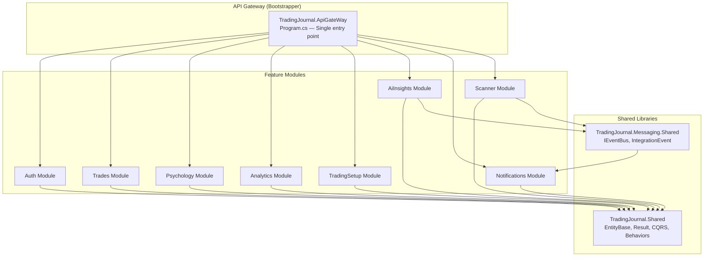
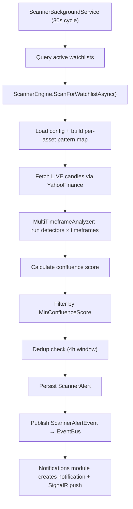
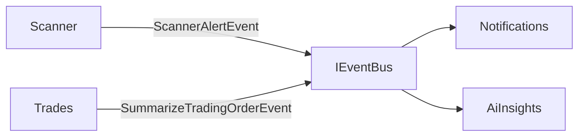

# Trading Journal Backend — Technical Specification

> **Last updated:** 2026-04-28
> **Runtime:** .NET 10 | **Database:** SQL Server | **Architecture:** Modular Monolith

---

## 1. System Overview

**Trading Journal** is a modular monolith backend built on **.NET 10** using **Vertical Slice Architecture** with **CQRS** (MediatR), **Carter** for minimal API routing, **Entity Framework Core 10** for data access, and **SignalR** for real-time communication. The system serves as a comprehensive trading journal platform with integrated algorithmic market scanning, AI-powered insights, and trader psychology tracking.

### Technology Stack

| Layer | Technology | Version |
|-------|-----------|---------|
| Runtime | .NET | 10.0 |
| Web Framework | ASP.NET Core Minimal APIs | 10.0 |
| Routing | Carter | 10.0.0 |
| CQRS / Mediator | MediatR | 14.1.0 |
| Validation | FluentValidation | 12.1.1 |
| ORM | Entity Framework Core | 10.0.6 |
| Database | SQL Server (MSSQL) | — |
| Real-time | ASP.NET Core SignalR | 10.0 |
| Auth | JWT Bearer + Google OAuth | — |
| Caching | HybridCache | 10.5.0 |
| API Docs | Scalar + Swashbuckle | — |
| Observability | OpenTelemetry | 1.15.2 |
| AI Integration | OpenRouter AI (Nemotron) | — |
| Market Data | Yahoo Finance, TwelveData | — |

---

## 2. Architecture

### 2.1 High-Level Architecture



### 2.2 Architectural Patterns

| Pattern | Implementation |
|---------|---------------|
| **Modular Monolith** | 8 independent modules under `/modules/`, each with own DbContext and schema |
| **Vertical Slice** | Each feature is a single file containing Request, Validator, Handler, and Endpoint |
| **CQRS** | Commands (`ICommand<T>`) and Queries (`IQuery<T>`) via MediatR |
| **Result Pattern** | `Result<T>` / `Result` for error handling without exceptions |
| **Event-Driven** | In-memory `IEventBus` with `IntegrationEvent` records for cross-module communication |
| **Soft Delete** | Global query filter via `AuditableDbContext` (`IsDisabled` flag) |
| **Audit Trail** | `EntityBase<T>` provides `CreatedDate`, `CreatedBy`, `UpdatedDate`, `UpdatedBy` |
| **User-Aware Requests** | `IUserAwareRequest` + `UserAwareBehavior` auto-injects `UserId` from JWT claims |

### 2.3 Solution Structure

```
trading-journal-backend/
├── TradingJournal.slnx
├── bootstrapper/
│   └── TradingJournal.ApiGateWay/         # Single host / composition root
├── shared/
│   ├── TradingJournal.Shared/             # Core abstractions
│   └── TradingJournal.Messaging.Shared/   # Event bus infrastructure
├── modules/                               # 8 feature modules
│   ├── Auth/
│   ├── Trades/
│   ├── Psychology/
│   ├── Analytics/
│   ├── TradingSetup/
│   ├── AiInsights/
│   ├── Notifications/
│   └── Scanner/
├── tests/                                 # Per-module test projects
└── jobs/                                  # Background job projects
```

### 2.4 Module Internal Structure (Canonical)

```
TradingJournal.Modules.{Name}/
├── Common/Constants/ & Enums/
├── Domain/              # EF Core entities (EntityBase<int>)
├── Dto/                 # Data transfer objects
├── Features/V1/         # Versioned vertical slices
├── Hubs/                # SignalR hubs (optional)
├── Infrastructure/      # IDbContext + implementation
├── Services/            # Domain/background services
├── Events/              # Published integration events
├── EventHandlers/       # Consumed integration events
├── Migrations/          # EF Core migrations
├── DependencyInjection.cs
└── GlobalUsings.cs
```

---

## 3. Shared Infrastructure

### 3.1 EntityBase

```csharp
public abstract class EntityBase<T>
{
    [Key, DatabaseGenerated(Identity)]
    public required T Id { get; set; }
    public DateTime CreatedDate { get; set; }
    public int CreatedBy { get; set; }
    public bool IsDisabled { get; set; } = false;   // Soft delete
    public DateTime? UpdatedDate { get; set; }
    public int? UpdatedBy { get; set; }
}
```

### 3.2 Result Pattern

```csharp
Result.Success() / Result.Failure(error)
Result<T>.Success(value) / Result<T>.Failure(error)
```

### 3.3 CQRS Interfaces

- `ICommand<TResponse>` — write operations
- `IQuery<TResponse>` — read operations
- `IUserAwareRequest` — auto-injects `UserId` from JWT via `UserAwareBehavior`
- `ICachedQuery<T>` — query caching via HybridCache

### 3.4 MediatR Pipeline Behaviors

1. **ValidationBehavior** — FluentValidation before handler
2. **UserAwareBehavior** — Injects authenticated user ID
3. **LoggingBehavior** — Request/response logging (dev only)

### 3.5 AuditableDbContext

Base class for all module DbContexts:
- Auto-populates `CreatedDate`/`CreatedBy` on insert, `UpdatedDate`/`UpdatedBy` on update
- Global query filter: `HasQueryFilter(e => !e.IsDisabled)`
- Transaction management

### 3.6 Event Bus (In-Memory)

- `IEventBus.PublishAsync<T>(event)` → `InMemoryMessageQueue`
- `IntegrationEventProcessorJob` (hosted service) dequeues and dispatches
- Events are `record` types extending `IntegrationEvent(Guid EventId)`

---

## 4. Database Architecture

### 4.1 Database Topology

| Database | Modules |
|----------|---------|
| `Trading_Journal` | Auth, Trades, Psychology, Analytics, TradingSetup, AiInsights, Notifications, Scanner |

### 4.2 Schema Isolation

| Module | Schema |
|--------|--------|
| Trades | `Trades` |
| Notifications | `Notification` |
| Scanner | `Scanner` |
| Others | Default |

---

## 5. Authentication & Authorization

- **JWT Bearer** (HS256, 60-min expiry, zero clock skew)
- **Google OAuth** external provider
- **SignalR auth**: JWT via `access_token` query param for `/hubs/*`
- **Admin policy**: `RequireRole("Admin")`
- **Rate limiting**: Global 120/min per IP; Auth 5/15min per IP+method

---

## 6. API Gateway

`Program.cs` registers all 8 modules, configures JWT + CORS + rate limiting, maps Carter endpoints and 2 SignalR hubs.

| Hub | Path | Purpose |
|-----|------|---------|
| `NotificationHub` | `/hubs/notifications` | Push notifications |
| `ScannerHub` | `/hubs/scanner` | Scanner alerts & status |

---

## 7. Module Catalog

### 7.1 Auth Module

User registration, JWT auth, Google OAuth, admin management.

**Feature Groups:** Auth (Login/Register/OAuth/Refresh), Staffs, AdminDashboard

---

### 7.2 Trades Module (`Trades` schema)

Core trade journaling — CRUD for trade history with full risk management tracking.

**Domain Entities (11):** `TradeHistory`, `TradeScreenShot`, `TradeEmotionTag`, `TradeHistoryChecklist`, `TradeTechnicalAnalysisTag`, `PretradeChecklist`, `ChecklistModel`, `TechnicalAnalysis`, `TradingSession`, `TradingZone`, `TradingProfile`

**Key fields on TradeHistory:** Asset, Position, Entry/Exit prices, PnL, SL/TP tiers, ConfidenceLevel, IsRuleBroken

**Feature Groups (11):** Trade, Screenshots, Checklists, ChecklistModels, TechnicalAnalysis, TradingSession, TradingZone, TradingProfile, Dashboard, Review, AiCoach

**Cross-module:** Implements `ITradeProvider`, `IAiTradeDataProvider`

---

### 7.3 Psychology Module

Trader psychology journaling — emotion tracking, confidence assessment.

**Domain Entities:** `PsychologyJournal`, `PsychologyJournalEmotion`, `EmotionTag`, `ConfidentLevel`

**Cross-module:** Implements `IPsychologyProvider`, `IEmotionTagProvider`

---

### 7.4 Analytics Module (Read-Only)

No own DB — computes analytics from trade data via shared interfaces.

**Endpoints:** `GetPerformanceSummary`, `GetEquityCurve`, `GetMonthlyReturns`, `GetAssetBreakdown`, `GetDayOfWeekBreakdown`, `GetInsights`

---

---

### 7.5 TradingSetup Module

Reusable trading setup templates with step-by-step entry criteria.

**Domain Entities:** `TradingSetup`, `SetupStep`, `SetupConnection`

---

### 7.6 AiInsights Module

AI-powered trade analysis using OpenRouter AI (Nemotron model).

**Domain Entities:** `TradingReview`, `TradingSummary`

**Event Handling:** Consumes `SummarizeTradingOrderEvent` from Trades module.

---

### 7.7 Notifications Module (`Notification` schema)

Cross-module notification system with real-time SignalR push.

**Domain Entity — Notification:**
- `UserId`, `Title` (200), `Message` (1000)
- `Type`: System, ScannerAlert, TradeReminder, AiInsight
- `Priority`: Low, Normal, High, Critical
- `IsRead`, `ReadAt`, `Metadata` (JSON, 4000), `ActionUrl` (500)

**REST Endpoints:**

| Method | Route | Description |
|--------|-------|-------------|
| GET | `/api/v1/notifications` | Paginated list |
| PUT | `/api/v1/notifications/{id}/read` | Mark as read |
| PUT | `/api/v1/notifications/read-all` | Mark all read |
| DELETE | `/api/v1/notifications/{id}` | Soft-delete |
| GET | `/api/v1/notifications/unread-count` | Unread count |

**SignalR:** `NotificationHub` — user group `user-{userId}`, pushes `NewNotification`, `NotificationRead`, `UnreadCountChanged`

---

### 7.8 Scanner Module (`Scanner` schema) — Most Complex

Real-time algorithmic scanner detecting ICT patterns across multiple timeframes.

#### Domain Entities

| Entity | Key Fields |
|--------|-----------|
| `Watchlist` | Name, UserId, IsActive, `IsScannerRunning` (persisted) |
| `WatchlistAsset` | WatchlistId, Symbol, DisplayName, EnabledDetectors[] |
| `WatchlistAssetDetector` | Per-asset pattern override (PatternType, IsEnabled) |
| `ScannerConfig` | Per-user: ScanIntervalSeconds (300), MinConfluenceScore, EnabledPatterns[], EnabledTimeframes[] |
| `ScannerAlert` | Symbol, PatternType, Timeframe, PriceAtDetection, ZoneHigh/Low, ConfluenceScore, DetectedAt, IsDismissed |

#### ICT Pattern Detectors (17)

| # | Detector | # | Detector |
|---|----------|---|----------|
| 1 | FVG | 10 | Market Structure Shift |
| 2 | Order Block | 11 | Change of Character |
| 3 | Breaker Block | 12 | Displacement |
| 4 | Liquidity Pool | 13 | Optimal Trade Entry |
| 5 | Liquidity Sweep | 14 | Judas Swing |
| 6 | Inversion FVG | 15 | Balanced Price Range |
| 7 | Unicorn Model | 16 | CISD |
| 8 | Venom Model | 17 | SMT Divergence (multi-asset) |
| 9 | Mitigation Block | | |

All implement `IIctDetector` (single-asset) or `IMultiAssetDetector` (SMT Divergence).

#### Scanner Engine Pipeline



#### Scanner REST Endpoints

| Method | Route | Description |
|--------|-------|-------------|
| POST | `/api/v1/scanner/watchlists` | Create watchlist |
| GET | `/api/v1/scanner/watchlists` | List watchlists |
| PUT | `/api/v1/scanner/watchlists/{id}` | Update watchlist |
| DELETE | `/api/v1/scanner/watchlists/{id}` | Delete watchlist |
| POST | `/api/v1/scanner/watchlists/{id}/assets` | Add asset |
| DELETE | `/api/v1/scanner/watchlists/{id}/assets/{assetId}` | Remove asset |
| PUT | `/api/v1/scanner/watchlists/{id}/start` | Start scanner |
| PUT | `/api/v1/scanner/watchlists/{id}/stop` | Stop scanner |
| GET | `.../assets/{assetId}/detectors` | Get per-asset detectors |
| PUT | `.../assets/{assetId}/detectors` | Update per-asset detectors |
| POST | `/api/v1/scanner/start` | Start global scanner |
| POST | `/api/v1/scanner/stop` | Stop global scanner |
| GET | `/api/v1/scanner/status` | Get scanner status |
| GET | `/api/v1/scanner/alerts` | List alerts |
| PUT | `/api/v1/scanner/alerts/{id}/dismiss` | Dismiss alert |
| GET | `/api/v1/scanner/economic-calendar` | Full calendar |
| GET | `.../economic-calendar/upcoming-high-impact` | High-impact events |

#### Economic Calendar

- `EconomicCalendarProvider` — scrapes Forex Factory
- `EconomicCalendarBackgroundService` — periodic refresh
- No API key required

---

## 8. Cross-Module Communication



**Shared Interfaces:**

| Interface | Provider | Consumer |
|-----------|----------|----------|
| `ITradeProvider` | Trades | Analytics, AiInsights |
| `IPsychologyProvider` | Psychology | Analytics |
| `IEmotionTagProvider` | Psychology | Trades |
| `IAiTradeDataProvider` | Trades | AiInsights |
| `ICacheRepository` | Shared | All modules |
| `IDateTimeProvider` | Shared | All modules |
| `IUserContext` | Shared | All modules |

---

## 9. Security

| Concern | Implementation |
|---------|---------------|
| Authentication | JWT Bearer (HS256, 60-min, zero clock skew) |
| External Auth | Google OAuth |
| Authorization | `[Authorize]` + `AdminOnly` policy |
| CORS | Explicit origin whitelist |
| Rate Limiting | Fixed-window per IP |
| HSTS | 365 days, preload |
| Soft Delete | Global query filter |
| Audit Trail | Auto `CreatedBy`/`UpdatedBy` from JWT |
| Input Validation | FluentValidation pipeline behavior |

---

## 10. Observability

- **OpenTelemetry** with OTLP exporter (HTTP + runtime instrumentation)
- Structured logging via `ILogger<T>`
- `LoggingBehavior` MediatR pipeline (dev only)

---

## 11. Key Design Decisions

| Decision | Rationale |
|----------|-----------|
| Modular monolith | Single-dev; module boundaries enable future microservice extraction |

| In-memory event bus | Sufficient for single-process; upgradable to RabbitMQ/Kafka |
| Per-watchlist scanner control | Granular; `IsScannerRunning` persisted in DB survives restarts |
| 4-hour dedup window | Prevents alert fatigue for recurring patterns |
| Yahoo Finance primary | Free, no API key, supports all symbols |
| Singleton detectors | ICT detectors are stateless pure functions |
| Carter over controllers | Minimal API routing with module endpoint grouping |
| Vertical slice architecture | Each feature self-contained in single file; easy to navigate |
