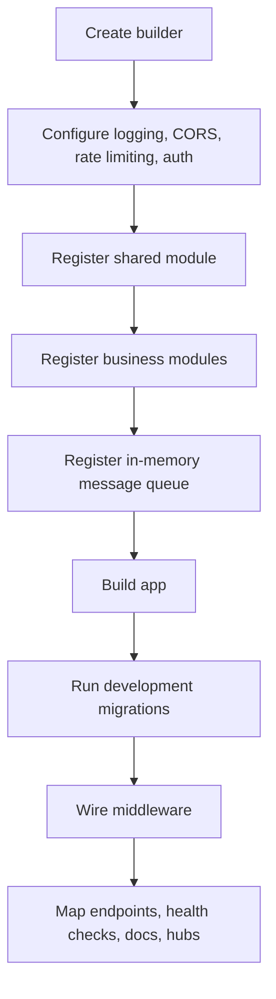
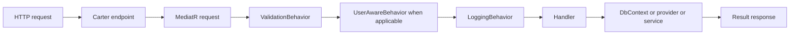
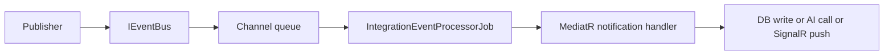

# Code Flow

## Startup Sequence

Startup in `Development` currently runs migrations for Trades, Psychology, TradingSetup, AiInsights, Notifications, Scanner, and RiskManagement. Auth is not part of that startup migration block.

## Request Path

## Async Event Path

## Real-Time Notification Path

1. A feature or event handler calls `INotificationService.CreateAndPushAsync(...)`.
2. Notification data is persisted.
3. The service pushes `NewNotification` to the `user-{userId}` SignalR group.
4. The unread count is recalculated and pushed as `UnreadCountChanged`.

## Hosted Services To Know

- `IntegrationEventProcessorJob`
- `IdempotencyCleanupService`
- `ScannerBackgroundService`
- `EconomicCalendarBackgroundService`

## Related Pages

- [Backend Overview](./Backend-Overview.md)
- [Technical Spec](./Technical-Spec.md)
- [Feature Flow](./Feature-Flow.md)