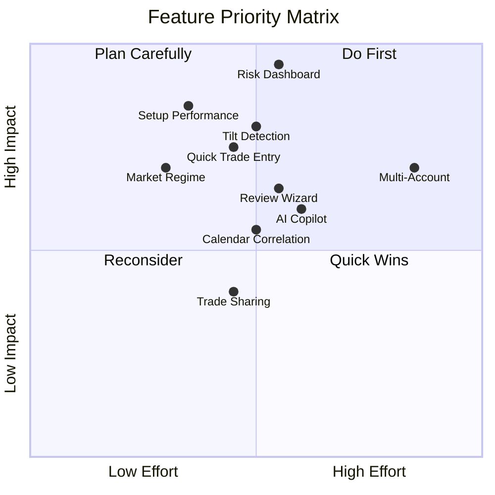

# 🚀 Feature Ideas to Improve Trading Process

## Current System Inventory

Before proposing new features, here's what you already have:

| Module | Key Capabilities |
|--------|-----------------|
| **Trades** | Trade journaling, entry/exit, PnL, emotions, screenshots, checklists, discipline logs, lessons learned |
| **Analytics** | Equity curve, monthly returns, asset breakdown, day-of-week breakdown, performance summary, insights |
| **Psychology** | Psychology journals with emotion tagging, confidence levels |
| **TradingSetup** | Trading setup/strategy definitions |
| **Scanner** | Real-time ICT pattern detection (FVG, OB, BB, Liquidity, Sweeps) with multi-TF confluence |
| **Notifications** | Real-time SignalR push notifications |
| **AiInsights** | AI coaching and trade reviews |

---

## 🏆 Tier 1 — High Impact, Fills Critical Gaps

### 1. Risk Management Dashboard & Guardrails

**Problem:** You track individual trade risk (SL, targets) but have no **portfolio-level** risk management. Professional traders need daily/weekly loss limits, max drawdown rules, and position correlation awareness.

**Proposed Solution:**

```
New Module: TradingJournal.Modules.RiskManagement
```

| Feature | Description |
|---------|-------------|
| **Daily Loss Limit** | Set a max daily loss (e.g., -2% of account). System warns/blocks when approaching limit |
| **Weekly Drawdown Cap** | Track cumulative weekly drawdown with visual gauge |
| **Position Sizing Engine** | Auto-calculate lot size based on account balance, risk %, and SL distance |
| **Correlation Matrix** | Show open position correlations (e.g., long EURUSD + long GBPUSD = correlated risk) |
| **Risk Heatmap** | Visual dashboard showing current exposure by asset class, direction, and session |
| **Account Balance Tracker** | Track account balance over time with deposit/withdrawal history |

**Backend scope:**
- Domain: `RiskConfig`, `DailyRiskSnapshot`, `AccountBalance`, `CorrelationRule`
- Integration: Subscribe to trade events from Trades module to update risk state in real-time
- Background service to compute daily risk snapshots at EOD

**Frontend scope:** New `/risk` dashboard page with gauges, heatmap, and correlation matrix

**Complexity:** 🟡 Medium — Mostly aggregation logic over existing trade data

---

### 2. Trade Playbook System

**Problem:** You have `TradingSetup` for defining strategies, but no structured **playbook** that links setups → specific entry conditions → expected outcomes → actual performance per playbook. Traders need to know *"Which of my setups actually makes money?"*

**Proposed Solution:**

Extend the existing `TradingSetup` module:

| Feature | Description |
|---------|-------------|
| **Playbook Entry** | Each setup becomes a playbook page with: entry rules, exit rules, ideal market conditions, example screenshots |
| **Setup Performance Dashboard** | Win rate, avg R:R, expectancy, profit factor — broken down by each setup |
| **Setup Grading** | Auto-grade each setup (A/B/C/D/F) based on historical performance |
| **Trade-to-Setup Linking** | Already partially done (from conversation history). Enhance to require setup selection at trade creation |
| **Setup Comparison** | Side-by-side comparison of two setups' performance metrics |
| **Kill Switch** | Mark underperforming setups as "retired" with a reason and date |

**Backend scope:**
- Extend `TradingSetup` domain with `SetupPerformanceSnapshot`, `SetupGrade`
- New Analytics endpoint: `GET /api/v1/analytics/setup-performance`
- Scheduled job to compute setup grades weekly

**Frontend scope:** Enhanced `/setup` page with performance cards, comparison view

**Complexity:** 🟢 Low-Medium — Mostly analytics queries over existing linked data

---

### 3. Streak & Tilt Detection System

**Problem:** Losing streaks cause emotional trading (tilt). Your Psychology module tracks emotions *after the fact*, but doesn't **proactively detect** when a trader is likely tilting and should stop.

**Proposed Solution:**

Enhance the Psychology module:

| Feature | Description |
|---------|-------------|
| **Streak Tracker** | Real-time tracking of consecutive wins/losses |
| **Tilt Score** | Algorithmic score (0-100) based on: recent losses, trade frequency spike, time-of-day, rule breaks |
| **Circuit Breaker Alert** | When tilt score exceeds threshold → push notification "You may be tilting. Consider taking a break." |
| **Cool-down Timer** | After X consecutive losses, suggest a mandatory break period |
| **Post-Tilt Review** | Auto-tag trades taken during high-tilt periods for review |
| **Tilt History Chart** | Visualize tilt score over time overlaid with equity curve |

**Backend scope:**
- New service: `TiltDetectionService` in Psychology module
- Domain: `TiltSnapshot` entity tracking score over time
- Subscribe to `TradeClosedEvent` to recalculate tilt score
- Integration with Notifications module for circuit breaker alerts

**Frontend scope:** Tilt gauge widget on dashboard, tilt history chart in psychology page

**Complexity:** 🟡 Medium — Requires event-driven logic + algorithmic scoring

---

## 🥈 Tier 2 — Strong Value-Add Features

### 4. Market Regime Classification

**Problem:** The Scanner detects ICT patterns, but doesn't classify the **market regime** (trending, ranging, volatile, quiet). The same setup performs differently in different regimes — traders need this context.

**Proposed Solution:**

Extend the Scanner module:

| Feature | Description |
|---------|-------------|
| **Regime Detector** | Classify current market state using ATR, ADX, and price structure |
| **Regime Labels** | Trending-Up, Trending-Down, Range-Bound, High-Volatility, Low-Volatility |
| **Regime Badge** | Show current regime badge on scanner alerts and trade creation form |
| **Regime Performance** | Analytics: "Your win rate in trending markets is 68% vs 34% in ranging" |
| **Regime Filter** | Filter scanner alerts by regime — only show FVG alerts in trending markets |

**Algorithm:**
```
ADX > 25 + Directional → Trending (Up/Down)
ADX < 20 + Low ATR   → Range-Bound  
ADX < 20 + High ATR  → Choppy/Volatile
```

**Backend scope:**
- New detector: `MarketRegimeDetector` implementing `IIctDetector` pattern
- Extend `ScannerAlert` with `MarketRegime` property
- New analytics endpoint for regime-based performance

**Complexity:** 🟢 Low — Leverages existing scanner infrastructure

---

### 5. Trade Journal Templates & Quick Entry

**Problem:** Creating a trade entry (`create-trade-page.tsx` is **74KB**!) is complex. Traders often skip journaling because it takes too long, especially during fast-moving sessions.

**Proposed Solution:**

| Feature | Description |
|---------|-------------|
| **Quick Trade Modal** | Minimal entry form: Asset, Direction, Entry, SL, TP → fills defaults from template |
| **Trade Templates** | Save frequently-used configurations (e.g., "EURUSD London OB Long" pre-fills asset, session, zone, setup) |
| **Scanner → Trade Pipeline** | One-click "Take Trade" button on scanner alerts that pre-fills trade entry with detected pattern data |
| **Partial Close Tracking** | Track when you take partials at Tier 1/2/3 targets with timestamps |
| **Trade Timer** | Auto-track trade duration from entry to exit |
| **Voice Notes** | Record audio notes during the trade (mobile-friendly) |

**Backend scope:**
- New domain: `TradeTemplate` in Trades module
- New endpoint: Quick trade creation with minimal required fields
- Extend `TradeHistory` with `DurationMinutes`, `PartialCloses` collection

**Frontend scope:** Quick-entry modal component, template management UI, scanner alert → trade flow

**Complexity:** 🟡 Medium — Significant UI work but straightforward backend

---

### 6. Weekly/Monthly Review Wizard

**Problem:** You have a `/review` page, but there's no **structured review workflow** that guides traders through a systematic review process with prompts and data.

**Proposed Solution:**

| Feature | Description |
|---------|-------------|
| **Review Wizard** | Step-by-step review flow: Performance Summary → Best/Worst Trades → Rule Compliance → Psychology Analysis → Goals → Action Items |
| **Auto-Generated Report** | System pre-fills data from the review period (win rate, PnL, top emotions, rule breaks) |
| **Comparative Review** | Compare this week vs last week, this month vs last month |
| **Action Items** | Create specific improvement goals from each review with follow-up tracking |
| **Review Streak** | Gamification: track consecutive weekly reviews completed |
| **PDF Export** | Export the review as a PDF for offline reference |

**Backend scope:**
- New domain: `TradingReview`, `ReviewActionItem` in Trades or new module
- Aggregation endpoint combining data from Analytics + Psychology + Trades
- PDF generation service

**Frontend scope:** Multi-step wizard component, comparative charts, PDF download

**Complexity:** 🟡 Medium — Data aggregation + multi-step UI

---

## 🥉 Tier 3 — Advanced / Nice-to-Have

### 7. Trade Journaling Copilot (AI Enhancement)

**Problem:** Your AI module has coaching and review, but doesn't assist **during** trade journaling. The AI could analyze screenshots, suggest setups, and auto-fill fields.

**Proposed Solution:**

| Feature | Description |
|---------|-------------|
| **Screenshot Analysis** | Upload chart screenshot → AI identifies the setup, key levels, and ICT patterns visible |
| **Auto-Tag Suggestions** | AI suggests technical analysis tags and emotion tags based on trade context |
| **Trade Narrative Generator** | AI writes a draft trade narrative from the raw data (entry, exit, setup, result) |
| **Pattern Recognition** | "This trade looks similar to 5 past trades where you won 4/5 times" |

**Backend scope:** Extend AiInsights with new prompt templates for trade-time assistance

**Complexity:** 🟡 Medium — Prompt engineering + vision API integration

---

### 8. Economic Calendar Integration Enhancement

**Problem:** From conversation history, you already started an Economic Calendar module. Enhancing it to **correlate news events with trade outcomes** would be very valuable.

**Proposed Solution:**

| Feature | Description |
|---------|-------------|
| **Event Impact Overlay** | Show high-impact news events on the equity curve chart |
| **News-Aware Scanner** | Scanner suppresses/boosts alerts around high-impact news |
| **Trade-Event Correlation** | "Your worst trades happen within 30 min of NFP releases" |
| **Pre-News Warning** | Alert before opening trades near high-impact events |

**Complexity:** 🟡 Medium — Requires calendar data source + event correlation

---

### 9. Multi-Account & Prop Firm Tracking

**Problem:** Many traders run multiple accounts (personal, prop firm challenges, funded accounts). No current support for tracking trades across accounts with different rules.

**Proposed Solution:**

| Feature | Description |
|---------|-------------|
| **Account Entity** | Account name, type (personal/prop/funded), balance, rules (max DD, profit target) |
| **Account Selector** | Global account selector in header, filters all data by account |
| **Prop Firm Rules Engine** | Track prop firm rules (daily DD, total DD, profit target, min trading days) |
| **Challenge Progress** | Visual progress tracker for prop firm challenges |
| **Account Comparison** | Compare performance across accounts |

**Backend scope:** New `Account` entity, add `AccountId` FK to `TradeHistory`

**Complexity:** 🔴 High — Cross-cutting concern affecting most modules

---

### 10. Trade Sharing & Export Hub

**Problem:** No way to share trade ideas, export data for tax purposes, or create portfolio summaries.

**Proposed Solution:**

| Feature | Description |
|---------|-------------|
| **Trade Card Generator** | Create shareable trade cards (image) with entry, exit, PnL, setup |
| **CSV/Excel Export** | Export filtered trade history for tax reporting |
| **Public Trade Link** | Share individual trades via public link (privacy-controlled) |
| **Broker Statement Import** | Import trades from MT4/MT5/cTrader statements |

**Complexity:** 🟡 Medium — Mostly new endpoints + file generation

---

## 📊 Priority Matrix



## 🎯 Recommended Implementation Order

| Priority | Feature | Why First? |
|----------|---------|-----------|
| **1** | Setup Performance Dashboard | Low effort, uses existing data, immediately actionable insights |
| **2** | Risk Management Dashboard | Critical safety net, protects capital |
| **3** | Tilt Detection & Circuit Breaker | Bridges Psychology → real-time intervention |
| **4** | Quick Trade Entry + Templates | Reduces friction, improves journal consistency |
| **5** | Market Regime Classification | Enhances existing scanner, adds context to every alert |
| **6** | Weekly Review Wizard | Enforces process discipline |
| **7-10** | Remaining features | Based on personal trading needs |

---

> [!TIP]
> **My recommendation:** Start with **#1 Setup Performance Dashboard** — it requires the least new infrastructure (just analytics queries over your existing trade-to-setup links) and will immediately tell you which of your setups to focus on and which to stop trading.

Which feature interests you most? I can create a detailed implementation plan and start building it.
