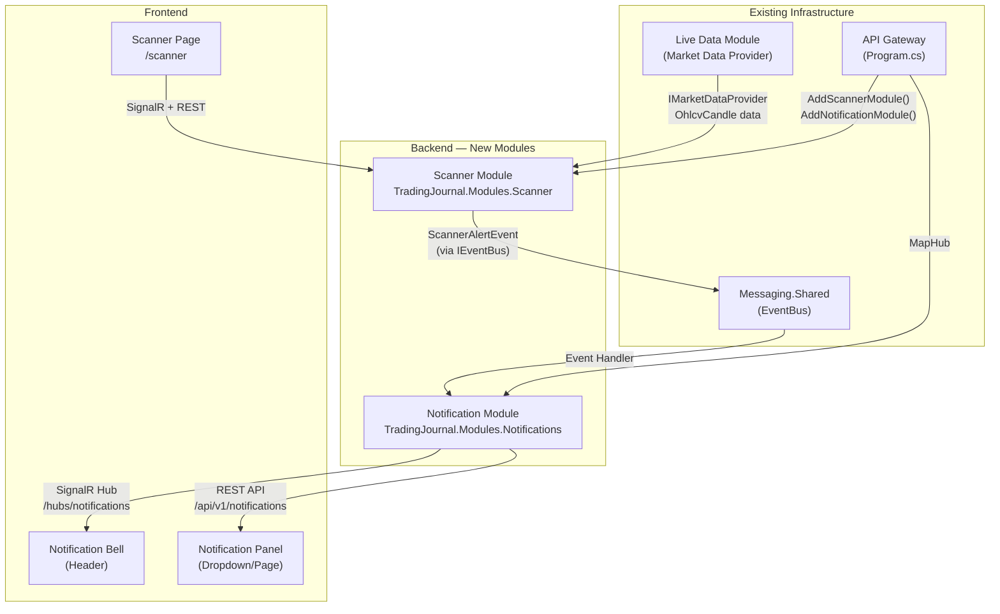

# Real-time Algorithmic Scanner & Notification System

## Implementation Plan

---

## Architecture Overview



---

## Phase 1: Notification Module (Backend)

> [!IMPORTANT]
> The Notification module is the foundation — both the Scanner and future features depend on it.

### 1.1 New Project: `TradingJournal.Modules.Notifications`

**Location:** `modules/Notifications/TradingJournal.Modules.Notifications/`

#### Directory Structure
```
modules/Notifications/TradingJournal.Modules.Notifications/
├── Common/
│   ├── Constants/
│   │   └── ApiGroup.cs
│   └── Enums/
│       ├── NotificationType.cs
│       └── NotificationPriority.cs
├── Domain/
│   ├── Notification.cs
│   └── NotificationPreference.cs
├── Dto/
│   └── NotificationDto.cs
├── Features/
│   └── V1/
│       ├── GetNotifications.cs
│       ├── MarkAsRead.cs
│       ├── MarkAllAsRead.cs
│       └── DeleteNotification.cs
├── Hubs/
│   └── NotificationHub.cs
├── Infrastructure/
│   ├── INotificationDbContext.cs
│   └── NotificationDbContext.cs
├── Services/
│   ├── INotificationService.cs
│   └── NotificationService.cs
├── EventHandlers/
│   └── ScannerAlertNotificationHandler.cs
├── DependencyInjection.cs
├── GlobalUsings.cs
└── TradingJournal.Modules.Notifications.csproj
```

#### Domain Entities

```csharp
// Notification.cs
[Table("Notifications", Schema = "Notification")]
[Index(nameof(UserId), nameof(IsRead), nameof(CreatedDate))]
public sealed class Notification : EntityBase<int>
{
    public int UserId { get; set; }

    [MaxLength(200)]
    public string Title { get; set; } = string.Empty;

    [MaxLength(1000)]
    public string Message { get; set; } = string.Empty;

    public NotificationType Type { get; set; }
    public NotificationPriority Priority { get; set; }
    public bool IsRead { get; set; } = false;
    public DateTime? ReadAt { get; set; }

    /// <summary>
    /// JSON payload for rich notification data (e.g., asset, timeframe, detected pattern)
    /// </summary>
    [MaxLength(4000)]
    public string? Metadata { get; set; }

    /// <summary>
    /// Optional deep-link URL for the frontend to navigate to
    /// </summary>
    [MaxLength(500)]
    public string? ActionUrl { get; set; }
}
```

```csharp
// Enums
public enum NotificationType
{
    System = 0,
    ScannerAlert = 1,
    TradeReminder = 2,
    AiInsight = 3
}

public enum NotificationPriority
{
    Low = 0,
    Normal = 1,
    High = 2,
    Critical = 3
}
```

#### SignalR Hub

```csharp
// NotificationHub.cs — follows BacktestHub pattern
[Authorize]
public sealed class NotificationHub(ILogger<NotificationHub> logger) : Hub
{
    // Server → Client events:
    //   - NewNotification: { Id, Title, Message, Type, Priority, Metadata, CreatedDate }
    //   - NotificationRead: { Id }
    //   - UnreadCountChanged: { Count }

    public override async Task OnConnectedAsync()
    {
        // Add user to personal group: "user-{userId}"
        var userId = Context.User!.GetCurrentUserId();
        await Groups.AddToGroupAsync(Context.ConnectionId, $"user-{userId}");
        logger.LogDebug("User {UserId} connected to notification hub", userId);
        await base.OnConnectedAsync();
    }

    public override async Task OnDisconnectedAsync(Exception? exception)
    {
        var userId = Context.User!.GetCurrentUserId();
        await Groups.RemoveFromGroupAsync(Context.ConnectionId, $"user-{userId}");
        await base.OnDisconnectedAsync(exception);
    }
}
```

#### Notification Service

```csharp
// INotificationService.cs
public interface INotificationService
{
    Task<int> CreateAndPushAsync(int userId, string title, string message,
        NotificationType type, NotificationPriority priority,
        string? metadata = null, string? actionUrl = null,
        CancellationToken ct = default);
}
```

The service will:
1. Save the notification to the database
2. Push it via SignalR to the user's group (`user-{userId}`)
3. Update the unread count

#### REST Endpoints (Carter)

| Method | Route | Description |
|--------|-------|-------------|
| `GET` | `/api/v1/notifications` | Paginated list (filtered by `?unreadOnly=true`) |
| `PUT` | `/api/v1/notifications/{id}/read` | Mark single as read |
| `PUT` | `/api/v1/notifications/read-all` | Mark all as read |
| `DELETE` | `/api/v1/notifications/{id}` | Soft-delete notification |
| `GET` | `/api/v1/notifications/unread-count` | Get unread count |

---

## Phase 2: Scanner Module (Backend)

### 2.1 New Project: `TradingJournal.Modules.Scanner`

**Location:** `modules/Scanner/TradingJournal.Modules.Scanner/`

#### Directory Structure
```
modules/Scanner/TradingJournal.Modules.Scanner/
├── Common/
│   ├── Constants/
│   │   └── ApiGroup.cs
│   └── Enums/
│       ├── ScannerTimeframe.cs
│       ├── IctPatternType.cs
│       └── ScannerStatus.cs
├── Domain/
│   ├── Watchlist.cs
│   ├── WatchlistAsset.cs
│   ├── ScannerAlert.cs
│   └── ScannerConfig.cs
├── Dto/
│   ├── WatchlistDto.cs
│   ├── ScannerAlertDto.cs
│   └── ScannerStatusDto.cs
├── Features/
│   └── V1/
│       ├── Watchlists/
│       │   ├── CreateWatchlist.cs
│       │   ├── GetWatchlists.cs
│       │   ├── UpdateWatchlist.cs
│       │   └── DeleteWatchlist.cs
│       ├── Alerts/
│       │   ├── GetAlerts.cs
│       │   └── DismissAlert.cs
│       └── Scanner/
│           ├── StartScanner.cs
│           ├── StopScanner.cs
│           └── GetScannerStatus.cs
├── Hubs/
│   └── ScannerHub.cs
├── Infrastructure/
│   ├── IScannerDbContext.cs
│   └── ScannerDbContext.cs
├── Services/
│   ├── ICTAnalysis/
│   │   ├── IIctDetector.cs
│   │   ├── FvgDetector.cs
│   │   ├── OrderBlockDetector.cs
│   │   ├── BreakerBlockDetector.cs
│   │   ├── LiquidityDetector.cs
│   │   └── LiquiditySweepDetector.cs
│   ├── IScannerEngine.cs
│   ├── ScannerEngine.cs
│   ├── ScannerBackgroundService.cs
│   └── MultiTimeframeAnalyzer.cs
├── Events/
│   └── ScannerAlertEvent.cs
├── DependencyInjection.cs
├── GlobalUsings.cs
└── TradingJournal.Modules.Scanner.csproj
```

#### Domain Entities

```csharp
// Watchlist.cs
[Table("Watchlists", Schema = "Scanner")]
public sealed class Watchlist : EntityBase<int>
{
    [MaxLength(100)]
    public string Name { get; set; } = string.Empty;

    public int UserId { get; set; }
    public bool IsActive { get; set; } = true;

    public ICollection<WatchlistAsset> Assets { get; set; } = [];
}

// WatchlistAsset.cs
[Table("WatchlistAssets", Schema = "Scanner")]
[Index(nameof(WatchlistId), nameof(Symbol), IsUnique = true)]
public sealed class WatchlistAsset : EntityBase<int>
{
    public int WatchlistId { get; set; }
    public Watchlist Watchlist { get; set; } = null!;

    [MaxLength(30)]
    public string Symbol { get; set; } = string.Empty;

    [MaxLength(100)]
    public string DisplayName { get; set; } = string.Empty;
}

// ScannerAlert.cs
[Table("ScannerAlerts", Schema = "Scanner")]
[Index(nameof(UserId), nameof(DetectedAt))]
public sealed class ScannerAlert : EntityBase<int>
{
    public int UserId { get; set; }

    [MaxLength(30)]
    public string Symbol { get; set; } = string.Empty;

    public IctPatternType PatternType { get; set; }
    public ScannerTimeframe Timeframe { get; set; }

    /// <summary>
    /// The timeframe where the pattern was detected
    /// </summary>
    public ScannerTimeframe DetectionTimeframe { get; set; }

    [Column(TypeName = "decimal(28,10)")]
    public decimal PriceAtDetection { get; set; }

    [Column(TypeName = "decimal(28,10)")]
    public decimal? ZoneHighPrice { get; set; }

    [Column(TypeName = "decimal(28,10)")]
    public decimal? ZoneLowPrice { get; set; }

    [MaxLength(500)]
    public string Description { get; set; } = string.Empty;

    /// <summary>
    /// Multi-timeframe confluence score (higher = more timeframes confirm)
    /// </summary>
    public int ConfluenceScore { get; set; }

    public DateTime DetectedAt { get; set; }
    public bool IsDismissed { get; set; } = false;
}

// ScannerConfig.cs
[Table("ScannerConfigs", Schema = "Scanner")]
[Index(nameof(UserId), IsUnique = true)]
public sealed class ScannerConfig : EntityBase<int>
{
    public int UserId { get; set; }

    /// <summary>
    /// Scan interval in seconds (minimum 60)
    /// </summary>
    public int ScanIntervalSeconds { get; set; } = 300; // 5 minutes default

    /// <summary>
    /// JSON array of enabled pattern types: ["FVG","OrderBlock",...]
    /// </summary>
    [MaxLength(500)]
    public string EnabledPatterns { get; set; } = "[\"FVG\",\"OrderBlock\",\"BreakerBlock\",\"Liquidity\",\"LiquiditySweep\"]";

    /// <summary>
    /// JSON array of enabled timeframes: ["D1","H1","M15","M5"]
    /// </summary>
    [MaxLength(200)]
    public string EnabledTimeframes { get; set; } = "[\"D1\",\"H1\",\"M15\",\"M5\"]";

    /// <summary>
    /// Minimum confluence score to trigger notification (1-4)
    /// </summary>
    public int MinConfluenceScore { get; set; } = 1;
}
```

#### ICT Pattern Enums

```csharp
public enum IctPatternType
{
    FVG = 1,              // Fair Value Gap
    OrderBlock = 2,       // Order Block (bullish/bearish)
    BreakerBlock = 3,     // Breaker Block
    Liquidity = 4,        // Liquidity pool (equal highs/lows)
    LiquiditySweep = 5    // Liquidity sweep (stop hunt)
}

public enum ScannerTimeframe
{
    M5 = 5,
    M15 = 15,
    H1 = 60,
    D1 = 1440
}

public enum ScannerStatus
{
    Stopped = 0,
    Running = 1,
    Error = 2
}
```

#### ICT Detection Algorithms

Each detector implements a common interface:

```csharp
public interface IIctDetector
{
    IctPatternType PatternType { get; }

    /// <summary>
    /// Analyzes a sequence of candles and returns detected patterns.
    /// Candles should be ordered chronologically (oldest first).
    /// </summary>
    List<DetectedPattern> Detect(IReadOnlyList<CandleData> candles, string symbol, ScannerTimeframe timeframe);
}

public record CandleData(DateTime Timestamp, decimal Open, decimal High, decimal Low, decimal Close, decimal Volume);

public record DetectedPattern(
    IctPatternType Type,
    ScannerTimeframe Timeframe,
    decimal PriceAtDetection,
    decimal? ZoneHigh,
    decimal? ZoneLow,
    string Description,
    DateTime DetectedAt);
```

**Detection Logic Summary:**

| Pattern | Algorithm |
|---------|-----------|
| **FVG** | 3-candle pattern: Gap between candle[0].high and candle[2].low (bullish) or candle[0].low and candle[2].high (bearish) where candle[1] doesn't fill the gap |
| **Order Block** | Last opposite candle before a strong impulsive move (3+ candles in one direction). Bullish OB = last bearish candle before bullish impulse |
| **Breaker Block** | A failed Order Block — price returns through the OB zone and breaks structure in the opposite direction |
| **Liquidity** | Equal highs/lows (within tolerance) forming a liquidity pool. Look for 2+ swing highs/lows at similar price levels |
| **Liquidity Sweep** | Price briefly exceeds a liquidity level then reverses. Wick beyond the level followed by close back inside |

#### Scanner Background Service

```csharp
// ScannerBackgroundService.cs
public sealed class ScannerBackgroundService : BackgroundService
{
    // Runs a loop that:
    // 1. Gets all active watchlists with scanner configs
    // 2. For each asset in each watchlist:
    //    a. Fetches recent candles from the Backtest module's OhlcvCandle table
    //       (or via IMarketDataProvider for live data)
    //    b. Runs all enabled IIctDetector instances across D1, H1, M15, M5
    //    c. Calculates confluence score (how many timeframes confirm)
    //    d. If new patterns detected → saves ScannerAlert + publishes ScannerAlertEvent
    // 3. Sleeps for the configured interval
}
```

#### Scanner SignalR Hub

```csharp
[Authorize]
public sealed class ScannerHub : Hub
{
    // Server → Client events:
    //   - ScannerAlertDetected: { Alert details }
    //   - ScannerStatusChanged: { Status, LastScanTime }
    //   - ScanCycleCompleted: { AssetsScanned, AlertsFound, Duration }
}
```

#### Integration with Notification Module

When the scanner detects a pattern:
1. Save `ScannerAlert` to scanner DB
2. Publish `ScannerAlertEvent` via `IEventBus`
3. `ScannerAlertNotificationHandler` in Notification module catches it
4. Creates a `Notification` and pushes via SignalR

```csharp
// ScannerAlertEvent.cs (in Messaging.Shared or Scanner module)
public sealed record ScannerAlertEvent(
    int UserId,
    string Symbol,
    string PatternType,
    string Timeframe,
    decimal Price,
    string Description,
    int ConfluenceScore) : IntegrationEvent;
```

#### Market Data Strategy

> [!TIP]
> **Re-use existing Backtest infrastructure.** The Backtest module already has `OhlcvCandle` data and `IMarketDataProvider` (TwelveData). The Scanner can:
> 1. **For assets with synced M1 data:** Query the Backtest DB's `OhlcvCandles` table and aggregate on-the-fly (same pattern as `CandleAggregationService`)
> 2. **For live data:** Use a shared `IMarketDataProvider` interface (extracted to Shared or cross-module contract)

This avoids duplicating the market data pipeline. We'll create a cross-module contract interface in `TradingJournal.Shared`:

```csharp
// In TradingJournal.Shared/Interfaces/IScannerMarketDataProvider.cs
public interface IScannerMarketDataProvider
{
    Task<List<CandleData>> GetRecentCandlesAsync(string symbol, int timeframeMinutes, int count, CancellationToken ct);
}
```

The Backtest module implements this interface, and the Scanner module consumes it via DI.

---

## Phase 3: API Gateway Integration

### 3.1 Changes to `Program.cs`

```diff
+using TradingJournal.Modules.Scanner;
+using TradingJournal.Modules.Notifications;
+using TradingJournal.Modules.Notifications.Hubs;
+using TradingJournal.Modules.Scanner.Hubs;

 builder.Services
     .AddSharedModule()
     .AddAuthModule(configuration, isDevelopment)
     ...
     .AddAiInsightsModule(configuration, isDevelopment)
+    .AddScannerModule(configuration, isDevelopment)
+    .AddNotificationModule(configuration, isDevelopment)
     .AddInMemoryMessageQueue();

 // After build:
+await app.MigrateScannerDatabase();
+await app.MigrateNotificationDatabase();

 // Hub mappings:
 app.MapHub<BacktestHub>("/hubs/backtest");
+app.MapHub<NotificationHub>("/hubs/notifications");
+app.MapHub<ScannerHub>("/hubs/scanner");
```

### 3.2 Changes to `TradingJournal.ApiGateWay.csproj`

```diff
+<ProjectReference Include="..\..\modules\Scanner\TradingJournal.Modules.Scanner\TradingJournal.Modules.Scanner.csproj" />
+<ProjectReference Include="..\..\modules\Notifications\TradingJournal.Modules.Notifications\TradingJournal.Modules.Notifications.csproj" />
```

### 3.3 Changes to `TradingJournal.slnx`

```diff
+<Project Path="modules/Scanner/TradingJournal.Modules.Scanner/TradingJournal.Modules.Scanner.csproj" />
+<Project Path="modules/Notifications/TradingJournal.Modules.Notifications/TradingJournal.Modules.Notifications.csproj" />
```

---

## Phase 4: Frontend Implementation

### 4.1 Notification System (UI)

#### New Files

| File | Purpose |
|------|---------|
| `lib/notification-api.ts` | REST API functions for notifications |
| `lib/stores/notification-store.ts` | Zustand store + SignalR connection |
| `components/notifications/notification-panel.tsx` | Full notification dropdown |
| `components/notifications/notification-item.tsx` | Single notification card |

#### SignalR Integration

```typescript
// lib/stores/notification-store.ts
import { HubConnectionBuilder, HubConnection } from "@microsoft/signalr";
import { create } from "zustand";

interface NotificationState {
  notifications: NotificationDto[];
  unreadCount: number;
  connection: HubConnection | null;
  
  connect: (token: string) => Promise<void>;
  disconnect: () => Promise<void>;
  markAsRead: (id: number) => Promise<void>;
  markAllAsRead: () => Promise<void>;
  fetchNotifications: () => Promise<void>;
}
```

#### Header Integration

Replace the current static notification bell dropdown in `components/header.tsx` with the real-time `NotificationPanel` component that:
- Shows unread count badge (pulsing animation when > 0)
- Displays real notifications from the API
- Updates in real-time via SignalR
- Plays subtle audio cue on new scanner alerts

### 4.2 Scanner Dashboard (UI)

#### New Files

| File | Purpose |
|------|---------|
| `app/scanner/page.tsx` | Scanner dashboard page |
| `app/scanner/layout.tsx` | Scanner layout |
| `components/scanner/watchlist-manager.tsx` | Manage watchlists & assets |
| `components/scanner/scanner-control.tsx` | Start/stop/configure scanner |
| `components/scanner/alert-feed.tsx` | Live alert feed |
| `components/scanner/alert-card.tsx` | Individual alert card with pattern visualization |
| `components/scanner/pattern-badge.tsx` | Color-coded ICT pattern badge |
| `components/scanner/confluence-indicator.tsx` | Multi-TF confluence visual |
| `lib/scanner-api.ts` | REST API functions |
| `lib/stores/scanner-store.ts` | Zustand store + SignalR |

#### Navigation Update

Add "Scanner" to the header navigation:
```typescript
{ name: "Scanner", href: "/scanner", icon: Radar },
```

---

## Implementation Order

> [!IMPORTANT]
> Recommended build sequence to maintain a working system at each step:

```mermaid
gantt
    title Implementation Timeline
    dateFormat X
    axisFormat %s

    section Phase 1 - Notifications
    Notification Domain & DB          :p1a, 0, 2
    Notification Service & Hub        :p1b, after p1a, 2
    Notification REST Endpoints       :p1c, after p1b, 1
    Gateway Integration               :p1d, after p1c, 1

    section Phase 2 - Scanner Backend
    Scanner Domain & DB               :p2a, after p1d, 2
    ICT Detection Algorithms          :p2b, after p2a, 4
    Market Data Integration           :p2c, after p2a, 2
    Scanner Background Service        :p2d, after p2b, 3
    Scanner Hub & Events              :p2e, after p2d, 2

    section Phase 3 - Frontend Notifications
    Notification Store & API          :p3a, after p1d, 2
    Notification Panel UI             :p3b, after p3a, 2
    Header Integration                :p3c, after p3b, 1

    section Phase 4 - Frontend Scanner
    Scanner API & Store               :p4a, after p2e, 2
    Scanner Dashboard Page            :p4b, after p4a, 3
    Alert Feed & Visualizations       :p4c, after p4b, 3
```



### Step-by-Step

1. **Notification Module Backend** → Domain, DbContext, Migration, Service, Hub, Endpoints, DI
2. **Gateway Integration** → Register notification module, map hub
3. **Scanner Module Backend** → Domain, DbContext, Migration, ICT detectors, Engine, Background service, Hub
4. **Cross-module Events** → ScannerAlertEvent → NotificationHandler
5. **Frontend Notifications** → Store, API, Panel component, Header integration
6. **Frontend Scanner** → Store, API, Dashboard page, Alert feed

---

## Key Design Decisions

| Decision | Rationale |
|----------|-----------|
| **Separate modules** (Scanner + Notifications) | Follows existing modular architecture. Notifications are reusable across features |
| **Re-use Backtest market data** | Avoids duplicate data storage and API rate limits. Backtest already has M1 candles + TwelveData provider |
| **Background service per-user** | Scanner runs server-side to avoid browser tab requirements. Configurable per-user interval |
| **Confluence scoring** | Multi-TF analysis produces a confidence score (1-4) to filter noise |
| **Integration events** | Scanner → Notification via `IEventBus` keeps modules decoupled |
| **Separate DB schemas** | `Scanner` and `Notification` schemas for clean separation |

---

## Open Questions for Review

1. **Market Data Source:** Should the scanner use the existing Backtest M1 candles (requires assets to be synced), or should it independently fetch live candles via the TwelveData API? The former is more efficient but requires the user to have synced the asset first.

2. **Scan Frequency:** Default scan interval is 5 minutes. Should this be user-configurable with a minimum? TwelveData has rate limits (~8 calls/min on free tier).

3. **Scanner Scope:** Should the scanner be a per-user background service, or a global singleton that scans all active watchlists? Per-user is simpler but scales worse.

4. **Alert Deduplication:** When the same FVG is detected on consecutive scans, should we suppress duplicates? If yes, what's the dedup window (e.g., don't re-alert for same pattern + symbol + timeframe within 4 hours)?

5. **Phase Priority:** Would you like me to start with **Phase 1 (Notification module backend)** first, or do you prefer a different order?
